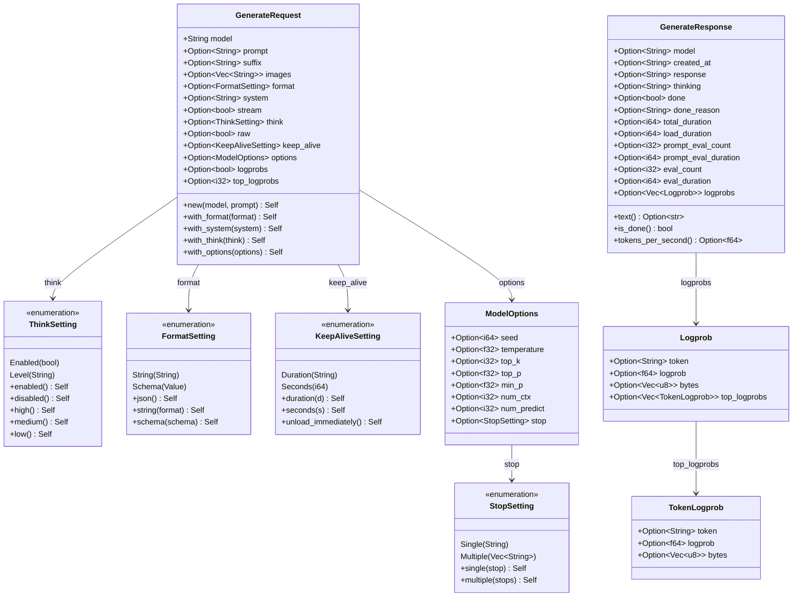
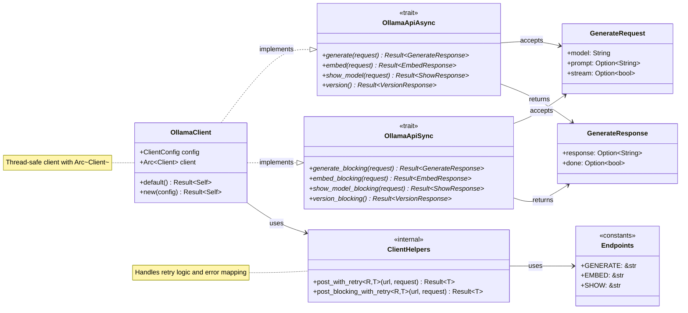
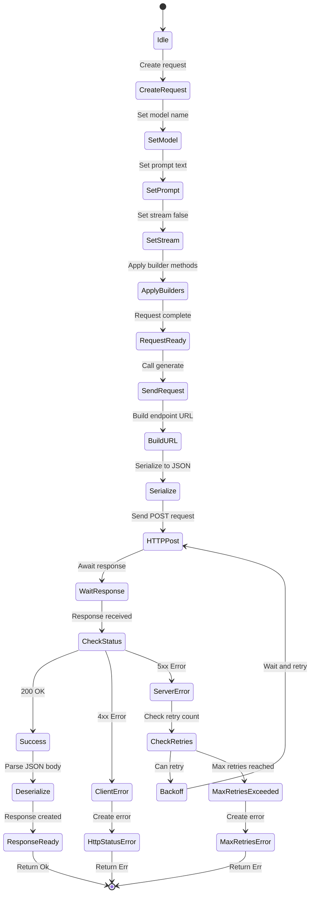
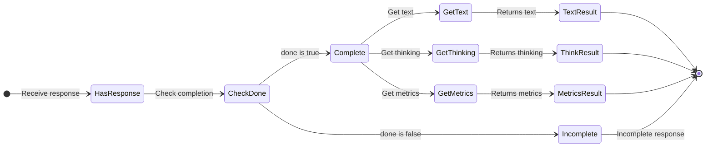
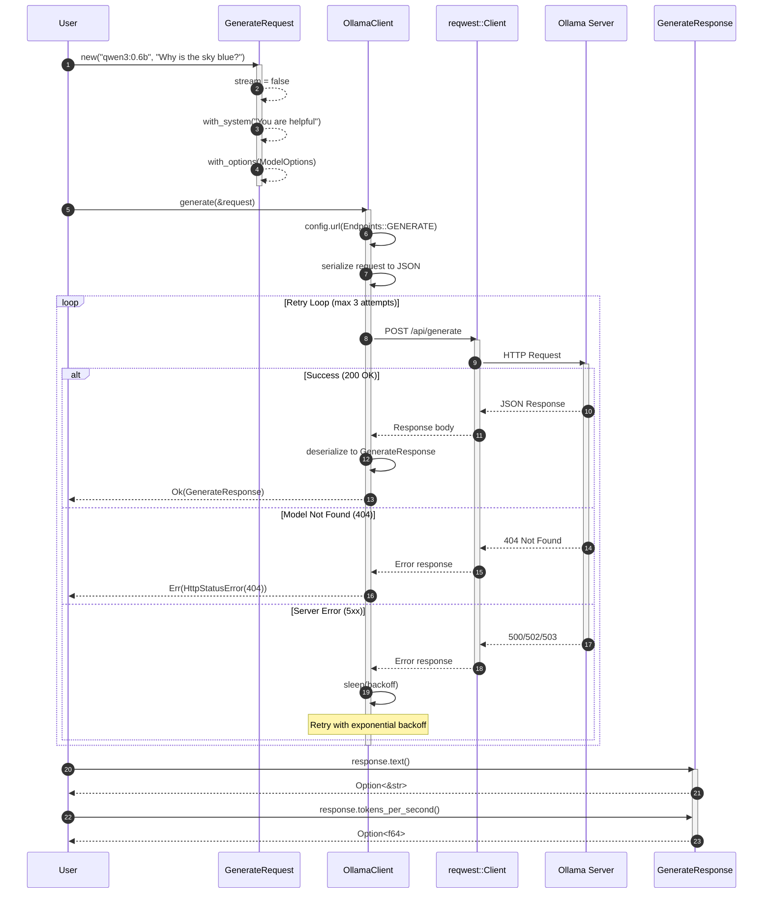
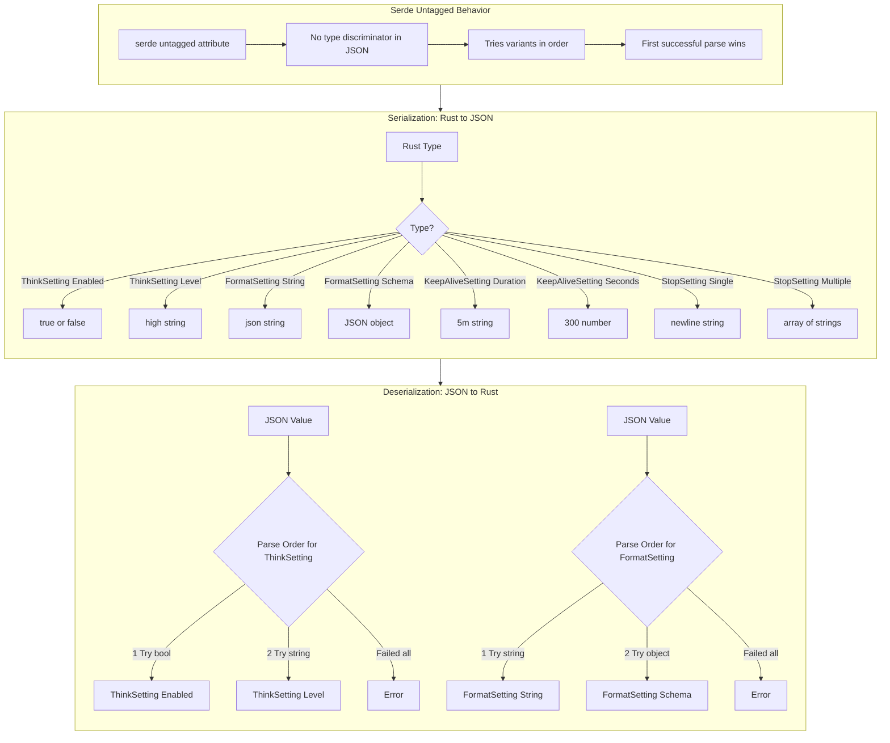

# Implementation Plan: POST /api/generate

**Endpoint:** POST /api/generate
**Complexity:** Complex (many optional fields, streaming support deferred, logprobs)
**Phase:** Phase 1 - Foundation + Non-Streaming Endpoints
**Document Version:** 1.0
**Created:** 2026-01-23

## Overview

This document outlines the implementation plan for the `POST /api/generate` endpoint, which generates text completions for a given prompt.

This endpoint is a **complex POST endpoint** with the following characteristics:
- Many optional request fields including `format`, `system`, `think`, `raw`, `images`
- Response includes performance metrics and optional `logprobs`
- Supports streaming (deferred to v0.2.0)
- For v0.1.0, we implement **non-streaming mode only** (`stream: false`)

**Key Differences from Embed:**
- More request parameters (images, suffix, format, system, raw, think, logprobs)
- Response includes generated text instead of embeddings
- Supports log probabilities output
- The `think` field can be boolean or string enum
- The `format` field can be string or JSON schema object

## API Specification Summary

**Endpoint:** `POST /api/generate`
**Operation ID:** `generate`
**Description:** Generates a response for the provided prompt

**Basic Request:**
```json
{
  "model": "qwen3:0.6b",
  "prompt": "Why is the sky blue?",
  "stream": false
}
```

**Full Request with Optional Parameters:**
```json
{
  "model": "qwen3:0.6b",
  "prompt": "Why is the sky blue?",
  "suffix": "",
  "images": ["base64-encoded-image"],
  "format": "json",
  "system": "You are a helpful assistant.",
  "stream": false,
  "think": true,
  "raw": false,
  "keep_alive": "5m",
  "options": {
    "temperature": 0.7,
    "top_k": 40,
    "top_p": 0.9,
    "num_predict": 100,
    "stop": ["\n"]
  },
  "logprobs": true,
  "top_logprobs": 5
}
```

**Response (Non-Streaming):**
```json
{
  "model": "qwen3:0.6b",
  "created_at": "2025-10-17T23:14:07.414671Z",
  "response": "The sky appears blue due to Rayleigh scattering...",
  "thinking": "Let me think about this...",
  "done": true,
  "done_reason": "stop",
  "total_duration": 174560334,
  "load_duration": 101397084,
  "prompt_eval_count": 11,
  "prompt_eval_duration": 13074791,
  "eval_count": 18,
  "eval_duration": 52479709,
  "logprobs": [
    {
      "token": "The",
      "logprob": -0.5,
      "bytes": [84, 104, 101],
      "top_logprobs": [
        {"token": "The", "logprob": -0.5, "bytes": [84, 104, 101]},
        {"token": "A", "logprob": -1.2, "bytes": [65]}
      ]
    }
  ]
}
```

**Error Responses:**
- `404 Not Found` - Model does not exist

## Schema Analysis

### New Types Required

1. **ThinkSetting** - Handles `oneOf: boolean | string("high"|"medium"|"low")`
2. **FormatSetting** - Handles `oneOf: string | object (JSON schema)`
3. **StopSetting** - Handles `oneOf: string | array of strings` (for ModelOptions)
4. **KeepAliveSetting** - Handles `oneOf: string | number`
5. **Logprob** - Log probability for a generated token
6. **TokenLogprob** - Log probability for a single token alternative
7. **GenerateRequest** - Request body
8. **GenerateResponse** - Response body

### Existing Types to Reuse

- **ModelOptions** - Already implemented (may need `stop` field update)

---

## Architecture Diagrams

### 1. Type Relations Diagram

This diagram shows the relationships and composition between all types involved in the generate endpoint.



### 2. Module and Function Relations Diagram

This diagram shows how types interact with the HTTP client layer and API traits.



### 3. API Call State Diagram

This diagram shows the states and results of a generate API call.



#### Response Usage State Diagram



### 4. Request/Response Flow Sequence Diagram

This diagram shows the sequence of operations for a generate request.



### 5. Type Hierarchy and Serde Behavior

This diagram shows how serde handles the untagged enum types.



---

## Type Definitions

### ThinkSetting (New Type)

```rust
/// Think setting for generate requests
///
/// Controls whether and how the model outputs its thinking process.
/// Can be a boolean (true/false) or a string ("high", "medium", "low").
///
/// # Examples
///
/// ```
/// use ollama_oxide::ThinkSetting;
///
/// let enabled = ThinkSetting::Enabled(true);
/// let high = ThinkSetting::Level("high".to_string());
/// ```
#[derive(Debug, Clone, PartialEq, Serialize, Deserialize)]
#[serde(untagged)]
pub enum ThinkSetting {
    /// Boolean: true to enable, false to disable
    Enabled(bool),
    /// Level: "high", "medium", or "low"
    Level(String),
}

impl ThinkSetting {
    /// Enable thinking output
    pub fn enabled() -> Self {
        Self::Enabled(true)
    }

    /// Disable thinking output
    pub fn disabled() -> Self {
        Self::Enabled(false)
    }

    /// Set thinking level
    pub fn level(level: impl Into<String>) -> Self {
        Self::Level(level.into())
    }

    /// High thinking level
    pub fn high() -> Self {
        Self::Level("high".to_string())
    }

    /// Medium thinking level
    pub fn medium() -> Self {
        Self::Level("medium".to_string())
    }

    /// Low thinking level
    pub fn low() -> Self {
        Self::Level("low".to_string())
    }
}

impl From<bool> for ThinkSetting {
    fn from(b: bool) -> Self {
        Self::Enabled(b)
    }
}

impl From<&str> for ThinkSetting {
    fn from(s: &str) -> Self {
        Self::Level(s.to_string())
    }
}
```

### FormatSetting (New Type)

```rust
/// Format setting for generate requests
///
/// Controls the output format of the model response.
/// Can be a string (like "json") or a JSON schema object.
///
/// # Examples
///
/// ```
/// use ollama_oxide::FormatSetting;
///
/// let json = FormatSetting::json();
/// let schema = FormatSetting::schema(serde_json::json!({
///     "type": "object",
///     "properties": { "name": { "type": "string" } }
/// }));
/// ```
#[derive(Debug, Clone, PartialEq, Serialize, Deserialize)]
#[serde(untagged)]
pub enum FormatSetting {
    /// Simple format string (e.g., "json")
    String(String),
    /// JSON schema object for structured output
    Schema(serde_json::Value),
}

impl FormatSetting {
    /// Create JSON format
    pub fn json() -> Self {
        Self::String("json".to_string())
    }

    /// Create custom format string
    pub fn string(format: impl Into<String>) -> Self {
        Self::String(format.into())
    }

    /// Create schema-based format
    pub fn schema(schema: serde_json::Value) -> Self {
        Self::Schema(schema)
    }
}

impl From<&str> for FormatSetting {
    fn from(s: &str) -> Self {
        Self::String(s.to_string())
    }
}

impl From<serde_json::Value> for FormatSetting {
    fn from(v: serde_json::Value) -> Self {
        Self::Schema(v)
    }
}
```

### KeepAliveSetting (New Type)

```rust
/// Keep alive setting for model caching
///
/// Controls how long the model stays loaded in memory.
/// Can be a string (e.g., "5m", "1h") or a number (seconds).
///
/// # Examples
///
/// ```
/// use ollama_oxide::KeepAliveSetting;
///
/// let duration = KeepAliveSetting::duration("5m");
/// let seconds = KeepAliveSetting::seconds(300);
/// let unload = KeepAliveSetting::seconds(0); // Unload immediately
/// ```
#[derive(Debug, Clone, PartialEq, Serialize, Deserialize)]
#[serde(untagged)]
pub enum KeepAliveSetting {
    /// Duration string (e.g., "5m", "1h", "30s")
    Duration(String),
    /// Duration in seconds
    Seconds(i64),
}

impl KeepAliveSetting {
    /// Create from duration string (e.g., "5m", "1h")
    pub fn duration(d: impl Into<String>) -> Self {
        Self::Duration(d.into())
    }

    /// Create from seconds
    pub fn seconds(s: i64) -> Self {
        Self::Seconds(s)
    }

    /// Unload model immediately after request
    pub fn unload_immediately() -> Self {
        Self::Seconds(0)
    }
}

impl From<&str> for KeepAliveSetting {
    fn from(s: &str) -> Self {
        Self::Duration(s.to_string())
    }
}

impl From<i64> for KeepAliveSetting {
    fn from(s: i64) -> Self {
        Self::Seconds(s)
    }
}
```

### TokenLogprob (New Type)

```rust
/// Log probability information for a single token alternative
///
/// Contains the token text, its log probability, and byte representation.
#[derive(Debug, Clone, PartialEq, Serialize, Deserialize)]
pub struct TokenLogprob {
    /// The text representation of the token
    #[serde(default)]
    pub token: Option<String>,

    /// The log probability of this token
    #[serde(default)]
    pub logprob: Option<f64>,

    /// The raw byte representation of the token
    #[serde(default)]
    pub bytes: Option<Vec<u8>>,
}
```

### Logprob (New Type)

```rust
/// Log probability information for a generated token
///
/// Contains the token, its log probability, byte representation,
/// and alternative tokens with their probabilities.
#[derive(Debug, Clone, PartialEq, Serialize, Deserialize)]
pub struct Logprob {
    /// The text representation of the token
    #[serde(default)]
    pub token: Option<String>,

    /// The log probability of this token
    #[serde(default)]
    pub logprob: Option<f64>,

    /// The raw byte representation of the token
    #[serde(default)]
    pub bytes: Option<Vec<u8>>,

    /// Most likely tokens and their log probabilities at this position
    #[serde(default)]
    pub top_logprobs: Option<Vec<TokenLogprob>>,
}
```

### GenerateRequest (New Type)

```rust
/// Request body for POST /api/generate endpoint
///
/// Generates a text completion for the provided prompt.
///
/// # Examples
///
/// Basic request:
/// ```
/// use ollama_oxide::GenerateRequest;
///
/// let request = GenerateRequest::new("qwen3:0.6b", "Why is the sky blue?");
/// ```
///
/// With options:
/// ```
/// use ollama_oxide::{GenerateRequest, ModelOptions};
///
/// let request = GenerateRequest::new("qwen3:0.6b", "Tell me a joke")
///     .with_system("You are a comedian.")
///     .with_options(ModelOptions::default().with_temperature(0.9));
/// ```
///
/// With JSON output format:
/// ```
/// use ollama_oxide::{GenerateRequest, FormatSetting};
///
/// let request = GenerateRequest::new("qwen3:0.6b", "List 3 colors as JSON")
///     .with_format(FormatSetting::json());
/// ```
#[derive(Debug, Clone, PartialEq, Serialize, Deserialize)]
pub struct GenerateRequest {
    /// Name of the model to use
    pub model: String,

    /// Text prompt to generate a response from
    #[serde(skip_serializing_if = "Option::is_none")]
    pub prompt: Option<String>,

    /// Text that appears after the prompt (for fill-in-the-middle)
    #[serde(skip_serializing_if = "Option::is_none")]
    pub suffix: Option<String>,

    /// Base64-encoded images for multimodal models
    #[serde(skip_serializing_if = "Option::is_none")]
    pub images: Option<Vec<String>>,

    /// Output format (string like "json" or JSON schema object)
    #[serde(skip_serializing_if = "Option::is_none")]
    pub format: Option<FormatSetting>,

    /// System prompt for the model
    #[serde(skip_serializing_if = "Option::is_none")]
    pub system: Option<String>,

    /// Whether to stream the response (always false for v0.1.0)
    #[serde(skip_serializing_if = "Option::is_none")]
    pub stream: Option<bool>,

    /// Control thinking output (bool or "high"/"medium"/"low")
    #[serde(skip_serializing_if = "Option::is_none")]
    pub think: Option<ThinkSetting>,

    /// Whether to return raw model output without templating
    #[serde(skip_serializing_if = "Option::is_none")]
    pub raw: Option<bool>,

    /// How long to keep the model loaded
    #[serde(skip_serializing_if = "Option::is_none")]
    pub keep_alive: Option<KeepAliveSetting>,

    /// Runtime options for generation
    #[serde(skip_serializing_if = "Option::is_none")]
    pub options: Option<ModelOptions>,

    /// Whether to return log probabilities
    #[serde(skip_serializing_if = "Option::is_none")]
    pub logprobs: Option<bool>,

    /// Number of top log probabilities to return
    #[serde(skip_serializing_if = "Option::is_none")]
    pub top_logprobs: Option<i32>,
}

impl GenerateRequest {
    /// Create a new generate request
    ///
    /// Creates a non-streaming request with the specified model and prompt.
    ///
    /// # Arguments
    ///
    /// * `model` - Name of the model to use
    /// * `prompt` - Text prompt for generation
    pub fn new(model: impl Into<String>, prompt: impl Into<String>) -> Self {
        Self {
            model: model.into(),
            prompt: Some(prompt.into()),
            suffix: None,
            images: None,
            format: None,
            system: None,
            stream: Some(false), // Non-streaming for v0.1.0
            think: None,
            raw: None,
            keep_alive: None,
            options: None,
            logprobs: None,
            top_logprobs: None,
        }
    }

    /// Set the suffix (for fill-in-the-middle)
    pub fn with_suffix(mut self, suffix: impl Into<String>) -> Self {
        self.suffix = Some(suffix.into());
        self
    }

    /// Add an image (base64-encoded)
    pub fn with_image(mut self, image: impl Into<String>) -> Self {
        self.images.get_or_insert_with(Vec::new).push(image.into());
        self
    }

    /// Set multiple images
    pub fn with_images<I, S>(mut self, images: I) -> Self
    where
        I: IntoIterator<Item = S>,
        S: Into<String>,
    {
        self.images = Some(images.into_iter().map(|s| s.into()).collect());
        self
    }

    /// Set the output format
    pub fn with_format(mut self, format: impl Into<FormatSetting>) -> Self {
        self.format = Some(format.into());
        self
    }

    /// Set the system prompt
    pub fn with_system(mut self, system: impl Into<String>) -> Self {
        self.system = Some(system.into());
        self
    }

    /// Set the think option
    pub fn with_think(mut self, think: impl Into<ThinkSetting>) -> Self {
        self.think = Some(think.into());
        self
    }

    /// Enable raw mode (no prompt templating)
    pub fn with_raw(mut self, raw: bool) -> Self {
        self.raw = Some(raw);
        self
    }

    /// Set the keep_alive duration
    pub fn with_keep_alive(mut self, keep_alive: impl Into<KeepAliveSetting>) -> Self {
        self.keep_alive = Some(keep_alive.into());
        self
    }

    /// Set model options
    pub fn with_options(mut self, options: ModelOptions) -> Self {
        self.options = Some(options);
        self
    }

    /// Enable log probabilities
    pub fn with_logprobs(mut self, logprobs: bool) -> Self {
        self.logprobs = Some(logprobs);
        self
    }

    /// Set number of top log probabilities to return
    pub fn with_top_logprobs(mut self, n: i32) -> Self {
        self.top_logprobs = Some(n);
        self
    }
}
```

### GenerateResponse (New Type)

```rust
/// Response from POST /api/generate endpoint
///
/// Contains the generated text and timing/usage metrics.
///
/// # Example Response
///
/// ```json
/// {
///   "model": "qwen3:0.6b",
///   "created_at": "2025-10-17T23:14:07.414671Z",
///   "response": "The sky is blue because...",
///   "done": true,
///   "done_reason": "stop",
///   "total_duration": 174560334,
///   "load_duration": 101397084,
///   "prompt_eval_count": 11,
///   "prompt_eval_duration": 13074791,
///   "eval_count": 18,
///   "eval_duration": 52479709
/// }
/// ```
#[derive(Debug, Clone, PartialEq, Serialize, Deserialize, Default)]
pub struct GenerateResponse {
    /// Model that generated the response
    #[serde(default)]
    pub model: Option<String>,

    /// ISO 8601 timestamp of response creation
    #[serde(default)]
    pub created_at: Option<String>,

    /// The model's generated text response
    #[serde(default)]
    pub response: Option<String>,

    /// The model's generated thinking output (if think was enabled)
    #[serde(default)]
    pub thinking: Option<String>,

    /// Indicates whether generation has finished
    #[serde(default)]
    pub done: Option<bool>,

    /// Reason the generation stopped (e.g., "stop", "length")
    #[serde(default)]
    pub done_reason: Option<String>,

    /// Total time spent generating the response in nanoseconds
    #[serde(default)]
    pub total_duration: Option<i64>,

    /// Time spent loading the model in nanoseconds
    #[serde(default)]
    pub load_duration: Option<i64>,

    /// Number of input tokens in the prompt
    #[serde(default)]
    pub prompt_eval_count: Option<i32>,

    /// Time spent evaluating the prompt in nanoseconds
    #[serde(default)]
    pub prompt_eval_duration: Option<i64>,

    /// Number of output tokens generated
    #[serde(default)]
    pub eval_count: Option<i32>,

    /// Time spent generating tokens in nanoseconds
    #[serde(default)]
    pub eval_duration: Option<i64>,

    /// Log probability information (if logprobs was enabled)
    #[serde(default)]
    pub logprobs: Option<Vec<Logprob>>,
}

impl GenerateResponse {
    /// Get the generated text response
    pub fn text(&self) -> Option<&str> {
        self.response.as_deref()
    }

    /// Get the thinking output (if available)
    pub fn thinking_text(&self) -> Option<&str> {
        self.thinking.as_deref()
    }

    /// Check if generation is complete
    pub fn is_done(&self) -> bool {
        self.done.unwrap_or(false)
    }

    /// Get total duration in milliseconds
    pub fn total_duration_ms(&self) -> Option<f64> {
        self.total_duration.map(|ns| ns as f64 / 1_000_000.0)
    }

    /// Get load duration in milliseconds
    pub fn load_duration_ms(&self) -> Option<f64> {
        self.load_duration.map(|ns| ns as f64 / 1_000_000.0)
    }

    /// Get prompt evaluation duration in milliseconds
    pub fn prompt_eval_duration_ms(&self) -> Option<f64> {
        self.prompt_eval_duration.map(|ns| ns as f64 / 1_000_000.0)
    }

    /// Get evaluation duration in milliseconds
    pub fn eval_duration_ms(&self) -> Option<f64> {
        self.eval_duration.map(|ns| ns as f64 / 1_000_000.0)
    }

    /// Calculate tokens per second for generation
    pub fn tokens_per_second(&self) -> Option<f64> {
        match (self.eval_count, self.eval_duration) {
            (Some(count), Some(duration)) if duration > 0 => {
                Some(count as f64 / (duration as f64 / 1_000_000_000.0))
            }
            _ => None,
        }
    }
}
```

## ModelOptions Update

The existing `ModelOptions` type needs to support the `stop` field which can be a string or array:

```rust
// Add to ModelOptions
/// Stop sequences that will halt generation
#[serde(skip_serializing_if = "Option::is_none")]
pub stop: Option<StopSetting>,
```

### StopSetting (New Type)

```rust
/// Stop setting for generation
///
/// Can be a single string or an array of strings.
#[derive(Debug, Clone, PartialEq, Serialize, Deserialize)]
#[serde(untagged)]
pub enum StopSetting {
    /// Single stop sequence
    Single(String),
    /// Multiple stop sequences
    Multiple(Vec<String>),
}

impl StopSetting {
    /// Create a single stop sequence
    pub fn single(stop: impl Into<String>) -> Self {
        Self::Single(stop.into())
    }

    /// Create multiple stop sequences
    pub fn multiple<I, S>(stops: I) -> Self
    where
        I: IntoIterator<Item = S>,
        S: Into<String>,
    {
        Self::Multiple(stops.into_iter().map(|s| s.into()).collect())
    }
}

impl From<&str> for StopSetting {
    fn from(s: &str) -> Self {
        Self::Single(s.to_string())
    }
}

impl From<Vec<String>> for StopSetting {
    fn from(v: Vec<String>) -> Self {
        Self::Multiple(v)
    }
}
```

## Implementation Strategy

### Step 1: Create Setting Types

**Files to create:**
- `src/primitives/think_setting.rs`
- `src/primitives/format_setting.rs`
- `src/primitives/keep_alive_setting.rs`
- `src/primitives/stop_setting.rs`

### Step 2: Create Logprob Types

**Files to create:**
- `src/primitives/token_logprob.rs`
- `src/primitives/logprob.rs`

### Step 3: Update ModelOptions

**File to modify:**
- `src/primitives/model_options.rs` - Add `stop` field with `StopSetting`

### Step 4: Create GenerateRequest

**File to create:**
- `src/primitives/generate_request.rs`

### Step 5: Create GenerateResponse

**File to create:**
- `src/primitives/generate_response.rs`

### Step 6: Update Primitives Module

**File to modify:**
- `src/primitives/mod.rs` - Add module declarations and re-exports

### Step 7: Add API Methods

**Files to modify:**
- `src/http/api_async.rs` - Add `generate()` method
- `src/http/api_sync.rs` - Add `generate_blocking()` method

### Step 8: Update lib.rs Re-exports

**File to modify:**
- `src/lib.rs` - Add new type re-exports

## API Method Signatures

### Async API

```rust
/// Generate text completion (async, non-streaming)
///
/// Generates a text completion for the provided prompt.
/// This method uses non-streaming mode.
///
/// # Arguments
///
/// * `request` - Generate request containing model, prompt, and options
///
/// # Errors
///
/// Returns an error if:
/// - Model doesn't exist (404)
/// - Network request fails
/// - Maximum retry attempts exceeded
///
/// # Examples
///
/// ```no_run
/// use ollama_oxide::{OllamaClient, OllamaApiAsync, GenerateRequest};
///
/// # async fn example() -> Result<(), Box<dyn std::error::Error>> {
/// let client = OllamaClient::default()?;
/// let request = GenerateRequest::new("qwen3:0.6b", "Why is the sky blue?");
/// let response = client.generate(&request).await?;
/// println!("Response: {:?}", response.text());
/// # Ok(())
/// # }
/// ```
async fn generate(&self, request: &GenerateRequest) -> Result<GenerateResponse>;
```

### Sync API

```rust
/// Generate text completion (blocking, non-streaming)
fn generate_blocking(&self, request: &GenerateRequest) -> Result<GenerateResponse>;
```

## Testing Strategy

### Unit Tests (`tests/client_generate_tests.rs`)

1. **Serialization Tests**
   - ThinkSetting: bool and string variants
   - FormatSetting: string and JSON schema variants
   - KeepAliveSetting: string and number variants
   - StopSetting: single and multiple variants
   - GenerateRequest: minimal and full
   - GenerateResponse: minimal and complete

2. **Request Builder Tests**
   - `GenerateRequest::new()` creates valid request with `stream: false`
   - Builder methods chain correctly
   - Optional fields serialize only when set

3. **Response Helper Tests**
   - `text()` returns response content
   - `is_done()` returns correct boolean
   - `tokens_per_second()` calculation
   - Duration conversion methods

4. **API Integration Tests (mocked)**
   - Successful generation request
   - Error handling (404 model not found)
   - Retry behavior on 5xx errors
   - Request/response serialization round-trip

### Test Count Target

Aim for **25-30 unit tests** covering:
- All new types serialization/deserialization
- Builder pattern methods
- Helper method calculations
- HTTP client integration with mocking

## Example Programs

### `examples/generate_async.rs`

```rust
//! Example: Generate text with async API
//!
//! Run with: cargo run --example generate_async

use ollama_oxide::{GenerateRequest, OllamaApiAsync, OllamaClient};

#[tokio::main]
async fn main() -> Result<(), Box<dyn std::error::Error>> {
    let client = OllamaClient::default()?;

    println!("Generating text...\n");

    let request = GenerateRequest::new("qwen3:0.6b", "Why is the sky blue?");
    let response = client.generate(&request).await?;

    println!("Response: {}", response.text().unwrap_or("No response"));
    println!("\nMetrics:");
    println!("  Model: {:?}", response.model);
    println!("  Done reason: {:?}", response.done_reason);
    println!("  Tokens generated: {:?}", response.eval_count);
    if let Some(tps) = response.tokens_per_second() {
        println!("  Tokens/sec: {:.2}", tps);
    }

    Ok(())
}
```

### `examples/generate_sync.rs`

```rust
//! Example: Generate text with sync API
//!
//! Run with: cargo run --example generate_sync

use ollama_oxide::{GenerateRequest, OllamaApiSync, OllamaClient};

fn main() -> Result<(), Box<dyn std::error::Error>> {
    let client = OllamaClient::default()?;

    let request = GenerateRequest::new("qwen3:0.6b", "Tell me a joke.");
    let response = client.generate_blocking(&request)?;

    println!("{}", response.text().unwrap_or("No response"));
    Ok(())
}
```

### `examples/generate_concise.rs`

This example demonstrates how to use the `stop` parameter to prevent model rambling,
based on a banking assistant scenario that needs to respond concisely.

**Scenario:** A virtual banking assistant that answers questions about interest rates
without rambling into comparisons, cross-selling, or unsolicited explanations.

```rust
//! Example: Concise responses using stop sequences
//!
//! Demonstrates how to use StopSetting to prevent model rambling
//! in a banking assistant scenario.
//!
//! Run with: cargo run --example generate_concise
//!
//! Based on: impl/10-post-generate-case.md

use ollama_oxide::{
    GenerateRequest, ModelOptions, OllamaApiAsync, OllamaClient, StopSetting,
};

#[tokio::main]
async fn main() -> Result<(), Box<dyn std::error::Error>> {
    let client = OllamaClient::default()?;
    let model = "qwen3:0.6b";

    // System prompt for concise banking assistant
    let system_prompt = r#"Strict instructions:
1. Answer ONLY with the requested information
2. Do not make comparisons with other banks
3. Do not offer additional information or products
4. Do not explain unsolicited concepts
5. Maximum format: 1-2 sentences"#;

    // Stop sequences to prevent rambling
    let stop_sequences = StopSetting::multiple([
        "\n\n",            // Prevents new paragraphs
        " Additionally",   // Prevents "Additionally..."
        " Comparing",      // Prevents comparisons
        " It's worth",     // Prevents unnecessary emphasis
        " It's important", // Prevents additional explanations
        " I can",          // Prevents help offers
        " By the way",     // Prevents cross-selling
    ]);

    // Model options for controlled generation
    let options = ModelOptions::new()
        .with_temperature(0.3)  // Low temperature for consistency
        .with_num_predict(100)  // Limit output tokens
        .with_stop(stop_sequences);

    println!("=== Banking Assistant (Concise Responses) ===\n");

    // Example 1: Interest rate question
    println!("Question: What is the overdraft rate?");
    let request = GenerateRequest::new(
        model,
        "What is your bank's overdraft interest rate?",
    )
    .with_system(system_prompt)
    .with_options(options.clone());

    let response = client.generate(&request).await?;
    println!("Response: {}\n", response.text().unwrap_or("No response"));

    // Example 2: Account balance question
    println!("Question: How do I check my balance?");
    let request = GenerateRequest::new(
        model,
        "How do I check my account balance?",
    )
    .with_system(system_prompt)
    .with_options(options.clone());

    let response = client.generate(&request).await?;
    println!("Response: {}\n", response.text().unwrap_or("No response"));

    // Example 3: What is inflation (educational, still concise)
    println!("Question: What is inflation?");
    let request = GenerateRequest::new(
        model,
        "What is inflation?",
    )
    .with_system(system_prompt)
    .with_options(options);

    let response = client.generate(&request).await?;
    println!("Response: {}\n", response.text().unwrap_or("No response"));

    println!("=== Demo Complete ===");
    println!("The 'stop' parameter helps cut off rambling early,");
    println!("keeping responses focused and objective.");

    Ok(())
}
```

**Key points demonstrated:**
- Using `StopSetting::multiple()` with several stop sequences
- Combining with `ModelOptions` (low temperature, limited tokens)
- Structured system prompt with clear instructions
- Practical banking assistant scenario

**Documented limitations (see impl/10-post-generate-case.md):**
- May have false positives cutting valid information
- Model can work around with synonyms
- Works best combined with other techniques

## File Checklist

### New Files

| File | Status | Description |
|------|--------|-------------|
| `src/primitives/think_setting.rs` | [ ] | ThinkSetting enum |
| `src/primitives/format_setting.rs` | [ ] | FormatSetting enum |
| `src/primitives/keep_alive_setting.rs` | [ ] | KeepAliveSetting enum |
| `src/primitives/stop_setting.rs` | [ ] | StopSetting enum |
| `src/primitives/token_logprob.rs` | [ ] | TokenLogprob struct |
| `src/primitives/logprob.rs` | [ ] | Logprob struct |
| `src/primitives/generate_request.rs` | [ ] | GenerateRequest struct |
| `src/primitives/generate_response.rs` | [ ] | GenerateResponse struct |
| `tests/client_generate_tests.rs` | [ ] | Unit tests |
| `examples/generate_async.rs` | [ ] | Async example |
| `examples/generate_sync.rs` | [ ] | Sync example |
| `examples/generate_concise.rs` | [ ] | Stop sequences example (banking assistant) |

### Modified Files

| File | Status | Changes |
|------|--------|---------|
| `src/primitives/model_options.rs` | [ ] | Add `stop` field |
| `src/primitives/mod.rs` | [ ] | Add module declarations and re-exports |
| `src/http/api_async.rs` | [ ] | Add `generate()` method |
| `src/http/api_sync.rs` | [ ] | Add `generate_blocking()` method |
| `src/lib.rs` | [ ] | Add new type re-exports |

## Implementation Order

1. **Setting Types** (no dependencies)
   - think_setting.rs
   - format_setting.rs
   - keep_alive_setting.rs
   - stop_setting.rs

2. **Logprob Types** (no dependencies)
   - token_logprob.rs
   - logprob.rs

3. **Update ModelOptions** (depends on stop_setting)
   - model_options.rs

4. **Request/Response Types** (depends on setting types)
   - generate_request.rs
   - generate_response.rs

5. **Module Updates**
   - primitives/mod.rs
   - lib.rs

6. **API Methods**
   - api_async.rs
   - api_sync.rs

7. **Tests & Examples**
   - client_generate_tests.rs
   - examples

## Notes

- All requests MUST set `stream: false` for v0.1.0
- The `GenerateRequest::new()` constructor sets `stream: Some(false)` by default
- Streaming support will be added in v0.2.0
- The existing `Endpoints::GENERATE` constant is already defined

## Definition of Done

- [ ] All new types implemented with Serialize/Deserialize
- [ ] Builder pattern for GenerateRequest
- [ ] Helper methods for GenerateResponse
- [ ] Async and sync API methods
- [ ] 25+ unit tests passing
- [ ] Three example programs working (async, sync, concise)
- [ ] All types re-exported from lib.rs
- [ ] Documentation with examples
- [ ] `cargo test` passes
- [ ] `cargo clippy` passes
- [ ] `cargo fmt` applied
