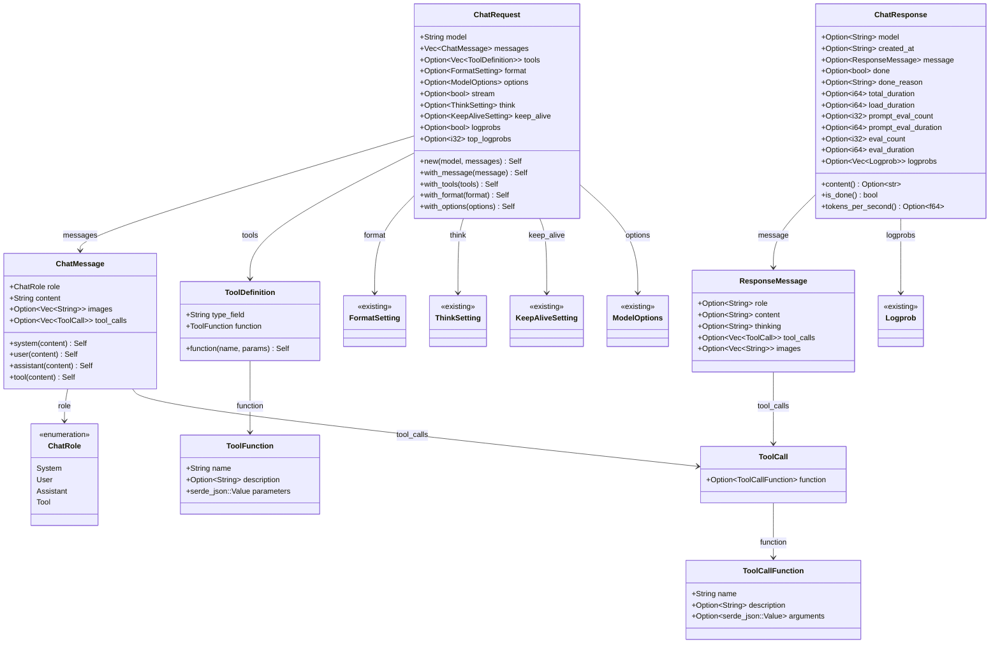
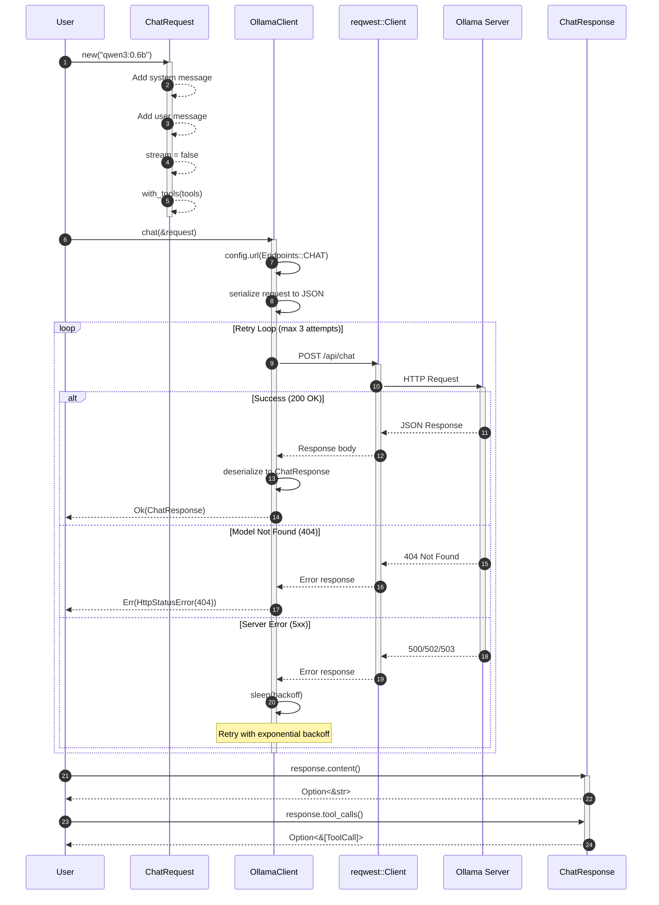
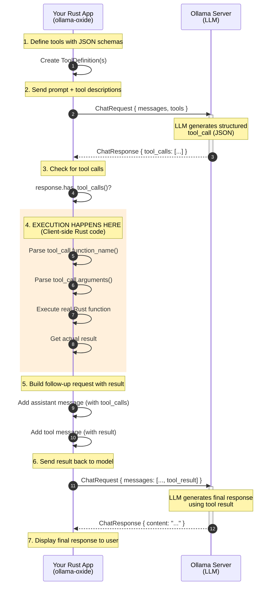
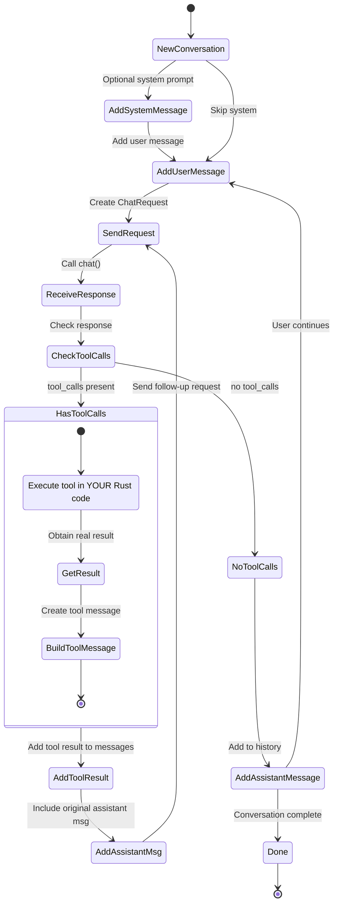

# Implementation Plan: POST /api/chat

**Endpoint:** POST /api/chat
**Complexity:** Complex (messages array, tools/function calling, streaming support deferred)
**Phase:** Phase 1 - Foundation + Non-Streaming Endpoints
**Document Version:** 1.0
**Created:** 2026-01-24

## Overview

This document outlines the implementation plan for the `POST /api/chat` endpoint, which generates the next chat message in a conversation between a user and an assistant.

This endpoint is a **complex POST endpoint** with the following characteristics:
- Messages array with role-based conversation history
- Support for tools/function calling
- Response includes assistant message with optional tool_calls
- Supports streaming (deferred to v0.2.0)
- For v0.1.0, we implement **non-streaming mode only** (`stream: false`)

**Key Differences from Generate:**
- Uses `messages` array instead of single `prompt` string
- No `suffix` or `raw` fields
- Has `tools` field for function definitions
- Response has `message` object instead of `response` string
- Message can include `tool_calls` array
- Supports multi-turn conversations

## API Specification Summary

**Endpoint:** `POST /api/chat`
**Operation ID:** `chat`
**Description:** Generate the next chat message in a conversation

**Basic Request:**
```json
{
  "model": "qwen3:0.6b",
  "messages": [
    {"role": "user", "content": "Hello, how are you?"}
  ],
  "stream": false
}
```

**Full Request with Optional Parameters:**
```json
{
  "model": "qwen3:0.6b",
  "messages": [
    {"role": "system", "content": "You are a helpful assistant."},
    {"role": "user", "content": "What's the weather in Paris?"}
  ],
  "tools": [
    {
      "type": "function",
      "function": {
        "name": "get_weather",
        "description": "Get the current weather for a location",
        "parameters": {
          "type": "object",
          "properties": {
            "location": {"type": "string"}
          },
          "required": ["location"]
        }
      }
    }
  ],
  "format": "json",
  "stream": false,
  "think": true,
  "keep_alive": "5m",
  "options": {
    "temperature": 0.7,
    "top_k": 40,
    "top_p": 0.9
  },
  "logprobs": true,
  "top_logprobs": 5
}
```

**Response (Non-Streaming):**
```json
{
  "model": "qwen3:0.6b",
  "created_at": "2025-10-17T23:14:07.414671Z",
  "message": {
    "role": "assistant",
    "content": "Hello! How can I help you today?",
    "thinking": "The user is greeting me...",
    "tool_calls": [
      {
        "function": {
          "name": "get_weather",
          "arguments": {"location": "Paris"}
        }
      }
    ]
  },
  "done": true,
  "done_reason": "stop",
  "total_duration": 174560334,
  "load_duration": 101397084,
  "prompt_eval_count": 11,
  "prompt_eval_duration": 13074791,
  "eval_count": 18,
  "eval_duration": 52479709
}
```

**Error Responses:**
- `404 Not Found` - Model does not exist

## Schema Analysis

### New Types Required

1. **ChatMessage** - Message in conversation (role, content, images, tool_calls)
2. **ChatRole** - Enum for message roles (system, user, assistant, tool)
3. **ToolDefinition** - Function tool definition
4. **ToolFunction** - Function details (name, description, parameters)
5. **ToolCall** - Tool call in response
6. **ToolCallFunction** - Function call details (name, arguments)
7. **ResponseMessage** - Message in response (role, content, thinking, tool_calls, images)
8. **ChatRequest** - Request body
9. **ChatResponse** - Response body

### Existing Types to Reuse

- **FormatSetting** - Already implemented for generate
- **ThinkSetting** - Already implemented for generate
- **KeepAliveSetting** - Already implemented for generate
- **ModelOptions** - Already implemented (with stop field)
- **Logprob** - Already implemented for generate
- **TokenLogprob** - Already implemented for generate

---

## Architecture Diagrams

### 1. Type Relations Diagram



### 2. Chat Flow Sequence Diagram



### 3. Tool Execution Flow (Client-Side)

> **IMPORTANT:** Tool calls are **executed on the client** (your Rust application), not on the Ollama server.
> The server only generates structured JSON describing which tool to call and with what arguments.
> Your application must interpret this, execute the actual code, and send results back.



### 4. Multi-turn Conversation Flow



---

## Type Definitions

### ChatRole (New Type)

```rust
/// Role of a message in the chat conversation
///
/// # Examples
///
/// ```
/// use ollama_oxide::ChatRole;
///
/// let role = ChatRole::User;
/// assert_eq!(serde_json::to_string(&role).unwrap(), "\"user\"");
/// ```
#[derive(Debug, Clone, Copy, PartialEq, Eq, Serialize, Deserialize)]
#[serde(rename_all = "lowercase")]
pub enum ChatRole {
    /// System message (sets behavior/context)
    System,
    /// User message (human input)
    User,
    /// Assistant message (model response)
    Assistant,
    /// Tool message (function call result)
    Tool,
}

impl Default for ChatRole {
    fn default() -> Self {
        Self::User
    }
}
```

### ChatMessage (New Type)

```rust
/// A message in a chat conversation
///
/// # Examples
///
/// ```
/// use ollama_oxide::ChatMessage;
///
/// let system = ChatMessage::system("You are a helpful assistant.");
/// let user = ChatMessage::user("Hello!");
/// let assistant = ChatMessage::assistant("Hi there!");
/// ```
#[derive(Debug, Clone, PartialEq, Serialize, Deserialize)]
pub struct ChatMessage {
    /// Role of the message author
    pub role: ChatRole,

    /// Text content of the message
    pub content: String,

    /// Optional base64-encoded images for multimodal models
    #[serde(skip_serializing_if = "Option::is_none")]
    pub images: Option<Vec<String>>,

    /// Tool calls made by the assistant (for assistant messages)
    #[serde(skip_serializing_if = "Option::is_none")]
    pub tool_calls: Option<Vec<ToolCall>>,
}

impl ChatMessage {
    /// Create a new message with the specified role and content
    pub fn new(role: ChatRole, content: impl Into<String>) -> Self {
        Self {
            role,
            content: content.into(),
            images: None,
            tool_calls: None,
        }
    }

    /// Create a system message
    pub fn system(content: impl Into<String>) -> Self {
        Self::new(ChatRole::System, content)
    }

    /// Create a user message
    pub fn user(content: impl Into<String>) -> Self {
        Self::new(ChatRole::User, content)
    }

    /// Create an assistant message
    pub fn assistant(content: impl Into<String>) -> Self {
        Self::new(ChatRole::Assistant, content)
    }

    /// Create a tool response message
    pub fn tool(content: impl Into<String>) -> Self {
        Self::new(ChatRole::Tool, content)
    }

    /// Add an image to the message (base64-encoded)
    pub fn with_image(mut self, image: impl Into<String>) -> Self {
        self.images.get_or_insert_with(Vec::new).push(image.into());
        self
    }

    /// Add multiple images
    pub fn with_images<I, S>(mut self, images: I) -> Self
    where
        I: IntoIterator<Item = S>,
        S: Into<String>,
    {
        self.images = Some(images.into_iter().map(|s| s.into()).collect());
        self
    }

    /// Add tool calls (for assistant messages)
    pub fn with_tool_calls(mut self, tool_calls: Vec<ToolCall>) -> Self {
        self.tool_calls = Some(tool_calls);
        self
    }
}
```

### ToolFunction (New Type)

```rust
/// Function definition for a tool
///
/// # Examples
///
/// ```
/// use ollama_oxide::ToolFunction;
/// use serde_json::json;
///
/// let func = ToolFunction::new("get_weather", json!({
///     "type": "object",
///     "properties": {
///         "location": {"type": "string"}
///     },
///     "required": ["location"]
/// }));
/// ```
#[derive(Debug, Clone, PartialEq, Serialize, Deserialize)]
pub struct ToolFunction {
    /// Name of the function
    pub name: String,

    /// Human-readable description of what the function does
    #[serde(skip_serializing_if = "Option::is_none")]
    pub description: Option<String>,

    /// JSON Schema describing the function parameters
    pub parameters: serde_json::Value,
}

impl ToolFunction {
    /// Create a new function definition
    pub fn new(name: impl Into<String>, parameters: serde_json::Value) -> Self {
        Self {
            name: name.into(),
            description: None,
            parameters,
        }
    }

    /// Add a description
    pub fn with_description(mut self, description: impl Into<String>) -> Self {
        self.description = Some(description.into());
        self
    }
}
```

### ToolDefinition (New Type)

```rust
/// Tool definition for function calling
///
/// # Examples
///
/// ```
/// use ollama_oxide::{ToolDefinition, ToolFunction};
/// use serde_json::json;
///
/// let tool = ToolDefinition::function(
///     "get_weather",
///     json!({"type": "object", "properties": {"location": {"type": "string"}}})
/// ).with_description("Get current weather for a location");
/// ```
#[derive(Debug, Clone, PartialEq, Serialize, Deserialize)]
pub struct ToolDefinition {
    /// Type of tool (always "function" currently)
    #[serde(rename = "type")]
    pub type_field: String,

    /// Function definition
    pub function: ToolFunction,
}

impl ToolDefinition {
    /// Create a function tool definition
    pub fn function(name: impl Into<String>, parameters: serde_json::Value) -> Self {
        Self {
            type_field: "function".to_string(),
            function: ToolFunction::new(name, parameters),
        }
    }

    /// Add a description to the function
    pub fn with_description(mut self, description: impl Into<String>) -> Self {
        self.function.description = Some(description.into());
        self
    }
}
```

### ToolCallFunction (New Type)

```rust
/// Function call details in a tool call
#[derive(Debug, Clone, PartialEq, Serialize, Deserialize)]
pub struct ToolCallFunction {
    /// Name of the function to call
    pub name: String,

    /// Description of what the function does
    #[serde(skip_serializing_if = "Option::is_none")]
    pub description: Option<String>,

    /// Arguments to pass to the function (as JSON object)
    #[serde(skip_serializing_if = "Option::is_none")]
    pub arguments: Option<serde_json::Value>,
}
```

### ToolCall (New Type)

```rust
/// A tool call requested by the assistant
///
/// # Examples
///
/// ```
/// use ollama_oxide::ToolCall;
///
/// // Typically received in response, not constructed manually
/// ```
#[derive(Debug, Clone, PartialEq, Serialize, Deserialize)]
pub struct ToolCall {
    /// Function call details
    #[serde(skip_serializing_if = "Option::is_none")]
    pub function: Option<ToolCallFunction>,
}

impl ToolCall {
    /// Get the function name if available
    pub fn function_name(&self) -> Option<&str> {
        self.function.as_ref().map(|f| f.name.as_str())
    }

    /// Get the function arguments if available
    pub fn arguments(&self) -> Option<&serde_json::Value> {
        self.function.as_ref().and_then(|f| f.arguments.as_ref())
    }
}
```

### ResponseMessage (New Type)

```rust
/// Message in a chat response
///
/// Contains the assistant's response, optional thinking output,
/// and any tool calls requested.
#[derive(Debug, Clone, PartialEq, Serialize, Deserialize, Default)]
pub struct ResponseMessage {
    /// Role (always "assistant" for responses)
    #[serde(default)]
    pub role: Option<String>,

    /// Assistant's text response
    #[serde(default)]
    pub content: Option<String>,

    /// Thinking/reasoning output (if think was enabled)
    #[serde(default)]
    pub thinking: Option<String>,

    /// Tool calls requested by the assistant
    #[serde(default)]
    pub tool_calls: Option<Vec<ToolCall>>,

    /// Optional images in response
    #[serde(default)]
    pub images: Option<Vec<String>>,
}
```

### ChatRequest (New Type)

```rust
/// Request body for POST /api/chat endpoint
///
/// Generates the next message in a chat conversation.
///
/// # Examples
///
/// Basic request:
/// ```
/// use ollama_oxide::{ChatRequest, ChatMessage};
///
/// let request = ChatRequest::new("qwen3:0.6b", vec![
///     ChatMessage::user("Hello!")
/// ]);
/// ```
///
/// With system message:
/// ```
/// use ollama_oxide::{ChatRequest, ChatMessage};
///
/// let request = ChatRequest::new("qwen3:0.6b", vec![
///     ChatMessage::system("You are a helpful assistant."),
///     ChatMessage::user("What is Rust?")
/// ]);
/// ```
///
/// With tools:
/// ```
/// use ollama_oxide::{ChatRequest, ChatMessage, ToolDefinition};
/// use serde_json::json;
///
/// let request = ChatRequest::new("qwen3:0.6b", vec![
///     ChatMessage::user("What's the weather in Paris?")
/// ]).with_tools(vec![
///     ToolDefinition::function("get_weather", json!({
///         "type": "object",
///         "properties": {"location": {"type": "string"}},
///         "required": ["location"]
///     }))
/// ]);
/// ```
#[derive(Debug, Clone, PartialEq, Serialize, Deserialize)]
pub struct ChatRequest {
    /// Name of the model to use
    pub model: String,

    /// Conversation history as array of messages
    pub messages: Vec<ChatMessage>,

    /// Optional list of function tools the model may call
    #[serde(skip_serializing_if = "Option::is_none")]
    pub tools: Option<Vec<ToolDefinition>>,

    /// Output format (string like "json" or JSON schema object)
    #[serde(skip_serializing_if = "Option::is_none")]
    pub format: Option<FormatSetting>,

    /// Runtime options for generation
    #[serde(skip_serializing_if = "Option::is_none")]
    pub options: Option<ModelOptions>,

    /// Whether to stream the response (always false for v0.1.0)
    #[serde(skip_serializing_if = "Option::is_none")]
    pub stream: Option<bool>,

    /// Control thinking output (bool or "high"/"medium"/"low")
    #[serde(skip_serializing_if = "Option::is_none")]
    pub think: Option<ThinkSetting>,

    /// How long to keep the model loaded
    #[serde(skip_serializing_if = "Option::is_none")]
    pub keep_alive: Option<KeepAliveSetting>,

    /// Whether to return log probabilities
    #[serde(skip_serializing_if = "Option::is_none")]
    pub logprobs: Option<bool>,

    /// Number of top log probabilities to return
    #[serde(skip_serializing_if = "Option::is_none")]
    pub top_logprobs: Option<i32>,
}

impl ChatRequest {
    /// Create a new chat request
    ///
    /// Creates a non-streaming request with the specified model and messages.
    pub fn new<M, I>(model: M, messages: I) -> Self
    where
        M: Into<String>,
        I: IntoIterator<Item = ChatMessage>,
    {
        Self {
            model: model.into(),
            messages: messages.into_iter().collect(),
            tools: None,
            format: None,
            options: None,
            stream: Some(false), // Non-streaming for v0.1.0
            think: None,
            keep_alive: None,
            logprobs: None,
            top_logprobs: None,
        }
    }

    /// Add a message to the conversation
    pub fn with_message(mut self, message: ChatMessage) -> Self {
        self.messages.push(message);
        self
    }

    /// Set tools for function calling
    pub fn with_tools(mut self, tools: Vec<ToolDefinition>) -> Self {
        self.tools = Some(tools);
        self
    }

    /// Add a single tool
    pub fn with_tool(mut self, tool: ToolDefinition) -> Self {
        self.tools.get_or_insert_with(Vec::new).push(tool);
        self
    }

    /// Set the output format
    pub fn with_format(mut self, format: impl Into<FormatSetting>) -> Self {
        self.format = Some(format.into());
        self
    }

    /// Set model options
    pub fn with_options(mut self, options: ModelOptions) -> Self {
        self.options = Some(options);
        self
    }

    /// Set the think option
    pub fn with_think(mut self, think: impl Into<ThinkSetting>) -> Self {
        self.think = Some(think.into());
        self
    }

    /// Set the keep_alive duration
    pub fn with_keep_alive(mut self, keep_alive: impl Into<KeepAliveSetting>) -> Self {
        self.keep_alive = Some(keep_alive.into());
        self
    }

    /// Enable log probabilities
    pub fn with_logprobs(mut self, logprobs: bool) -> Self {
        self.logprobs = Some(logprobs);
        self
    }

    /// Set number of top log probabilities to return
    pub fn with_top_logprobs(mut self, n: i32) -> Self {
        self.top_logprobs = Some(n);
        self
    }
}
```

### ChatResponse (New Type)

```rust
/// Response from POST /api/chat endpoint
///
/// Contains the assistant's message and timing/usage metrics.
#[derive(Debug, Clone, PartialEq, Serialize, Deserialize, Default)]
pub struct ChatResponse {
    /// Model that generated the response
    #[serde(default)]
    pub model: Option<String>,

    /// ISO 8601 timestamp of response creation
    #[serde(default)]
    pub created_at: Option<String>,

    /// The assistant's response message
    #[serde(default)]
    pub message: Option<ResponseMessage>,

    /// Indicates whether generation has finished
    #[serde(default)]
    pub done: Option<bool>,

    /// Reason the generation stopped (e.g., "stop", "length")
    #[serde(default)]
    pub done_reason: Option<String>,

    /// Total time spent generating the response in nanoseconds
    #[serde(default)]
    pub total_duration: Option<i64>,

    /// Time spent loading the model in nanoseconds
    #[serde(default)]
    pub load_duration: Option<i64>,

    /// Number of input tokens in the prompt
    #[serde(default)]
    pub prompt_eval_count: Option<i32>,

    /// Time spent evaluating the prompt in nanoseconds
    #[serde(default)]
    pub prompt_eval_duration: Option<i64>,

    /// Number of output tokens generated
    #[serde(default)]
    pub eval_count: Option<i32>,

    /// Time spent generating tokens in nanoseconds
    #[serde(default)]
    pub eval_duration: Option<i64>,

    /// Log probability information (if logprobs was enabled)
    #[serde(default)]
    pub logprobs: Option<Vec<Logprob>>,
}

impl ChatResponse {
    /// Get the assistant's text response
    pub fn content(&self) -> Option<&str> {
        self.message.as_ref().and_then(|m| m.content.as_deref())
    }

    /// Get the thinking output (if available)
    pub fn thinking(&self) -> Option<&str> {
        self.message.as_ref().and_then(|m| m.thinking.as_deref())
    }

    /// Get tool calls from the response
    pub fn tool_calls(&self) -> Option<&[ToolCall]> {
        self.message.as_ref().and_then(|m| m.tool_calls.as_deref())
    }

    /// Check if the response contains tool calls
    pub fn has_tool_calls(&self) -> bool {
        self.tool_calls().map(|tc| !tc.is_empty()).unwrap_or(false)
    }

    /// Check if generation is complete
    pub fn is_done(&self) -> bool {
        self.done.unwrap_or(false)
    }

    /// Get total duration in milliseconds
    pub fn total_duration_ms(&self) -> Option<f64> {
        self.total_duration.map(|ns| ns as f64 / 1_000_000.0)
    }

    /// Get load duration in milliseconds
    pub fn load_duration_ms(&self) -> Option<f64> {
        self.load_duration.map(|ns| ns as f64 / 1_000_000.0)
    }

    /// Get prompt evaluation duration in milliseconds
    pub fn prompt_eval_duration_ms(&self) -> Option<f64> {
        self.prompt_eval_duration.map(|ns| ns as f64 / 1_000_000.0)
    }

    /// Get evaluation duration in milliseconds
    pub fn eval_duration_ms(&self) -> Option<f64> {
        self.eval_duration.map(|ns| ns as f64 / 1_000_000.0)
    }

    /// Calculate tokens per second for generation
    pub fn tokens_per_second(&self) -> Option<f64> {
        match (self.eval_count, self.eval_duration) {
            (Some(count), Some(duration)) if duration > 0 => {
                Some(count as f64 / (duration as f64 / 1_000_000_000.0))
            }
            _ => None,
        }
    }
}
```

## Implementation Strategy

### Step 1: Create Message Types

**Files to create:**
- `src/primitives/chat_role.rs`
- `src/primitives/chat_message.rs`

### Step 2: Create Tool Types

**Files to create:**
- `src/primitives/tool_function.rs`
- `src/primitives/tool_definition.rs`
- `src/primitives/tool_call_function.rs`
- `src/primitives/tool_call.rs`

### Step 3: Create Response Message Type

**File to create:**
- `src/primitives/response_message.rs`

### Step 4: Create ChatRequest

**File to create:**
- `src/primitives/chat_request.rs`

### Step 5: Create ChatResponse

**File to create:**
- `src/primitives/chat_response.rs`

### Step 6: Update Primitives Module

**File to modify:**
- `src/primitives/mod.rs` - Add module declarations and re-exports

### Step 7: Add API Methods

**Files to modify:**
- `src/http/api_async.rs` - Add `chat()` method
- `src/http/api_sync.rs` - Add `chat_blocking()` method

### Step 8: Update lib.rs Re-exports

**File to modify:**
- `src/lib.rs` - Add new type re-exports

## API Method Signatures

### Async API

```rust
/// Chat completion (async, non-streaming)
///
/// Generates the next message in a chat conversation.
/// This method uses non-streaming mode.
///
/// # Arguments
///
/// * `request` - Chat request containing model, messages, and options
///
/// # Errors
///
/// Returns an error if:
/// - Model doesn't exist (404)
/// - Network request fails
/// - Maximum retry attempts exceeded
///
/// # Examples
///
/// ```no_run
/// use ollama_oxide::{OllamaClient, OllamaApiAsync, ChatRequest, ChatMessage};
///
/// # async fn example() -> Result<(), Box<dyn std::error::Error>> {
/// let client = OllamaClient::default()?;
/// let request = ChatRequest::new("qwen3:0.6b", vec![
///     ChatMessage::user("Hello!")
/// ]);
/// let response = client.chat(&request).await?;
/// println!("Response: {:?}", response.content());
/// # Ok(())
/// # }
/// ```
async fn chat(&self, request: &ChatRequest) -> Result<ChatResponse>;
```

### Sync API

```rust
/// Chat completion (blocking, non-streaming)
fn chat_blocking(&self, request: &ChatRequest) -> Result<ChatResponse>;
```

## Testing Strategy

### Unit Tests (`tests/client_chat_tests.rs`)

1. **Role Serialization Tests**
   - ChatRole serializes to lowercase strings
   - ChatRole deserializes correctly

2. **Message Tests**
   - ChatMessage::system(), user(), assistant(), tool() constructors
   - ChatMessage with images
   - ChatMessage serialization

3. **Tool Tests**
   - ToolFunction creation
   - ToolDefinition creation
   - ToolCall deserialization
   - ToolCallFunction deserialization

4. **Request Builder Tests**
   - ChatRequest::new() creates valid request with `stream: false`
   - Builder methods chain correctly
   - with_tools(), with_message()

5. **Response Helper Tests**
   - content() returns message content
   - tool_calls() returns tool calls
   - has_tool_calls() detection
   - is_done() returns correct boolean
   - tokens_per_second() calculation

6. **API Integration Tests (mocked)**
   - Successful chat request
   - Chat with tools response
   - Error handling (404 model not found)
   - Retry behavior on 5xx errors

### Test Count Target

Aim for **40-50 unit tests** covering all new types.

## Example Programs

### `examples/chat_async.rs`

```rust
//! Example: Chat with async API
//!
//! Run with: cargo run --example chat_async

use ollama_oxide::{ChatMessage, ChatRequest, OllamaApiAsync, OllamaClient};

#[tokio::main]
async fn main() -> Result<(), Box<dyn std::error::Error>> {
    let client = OllamaClient::default()?;
    let model = "qwen3:0.6b";

    println!("=== Chat Example (Async) ===\n");

    // Simple conversation
    let request = ChatRequest::new(model, vec![
        ChatMessage::system("You are a helpful assistant."),
        ChatMessage::user("What is Rust programming language?"),
    ]);

    let response = client.chat(&request).await?;
    println!("Assistant: {}\n", response.content().unwrap_or("No response"));

    // Multi-turn conversation
    let request = ChatRequest::new(model, vec![
        ChatMessage::system("You are a helpful assistant."),
        ChatMessage::user("What is Rust?"),
        ChatMessage::assistant("Rust is a systems programming language focused on safety and performance."),
        ChatMessage::user("What are its main features?"),
    ]);

    let response = client.chat(&request).await?;
    println!("Follow-up: {}\n", response.content().unwrap_or("No response"));

    if let Some(tps) = response.tokens_per_second() {
        println!("Tokens/sec: {:.2}", tps);
    }

    Ok(())
}
```

### `examples/chat_sync.rs`

```rust
//! Example: Chat with sync API
//!
//! Run with: cargo run --example chat_sync

use ollama_oxide::{ChatMessage, ChatRequest, OllamaApiSync, OllamaClient};

fn main() -> Result<(), Box<dyn std::error::Error>> {
    let client = OllamaClient::default()?;

    let request = ChatRequest::new("qwen3:0.6b", vec![
        ChatMessage::user("Tell me a short joke."),
    ]);

    let response = client.chat_blocking(&request)?;
    println!("{}", response.content().unwrap_or("No response"));

    Ok(())
}
```

### `examples/chat_with_tools.rs`

```rust
//! Example: Chat with function calling
//!
//! Run with: cargo run --example chat_with_tools

use ollama_oxide::{
    ChatMessage, ChatRequest, OllamaApiAsync, OllamaClient, ToolDefinition,
};
use serde_json::json;

#[tokio::main]
async fn main() -> Result<(), Box<dyn std::error::Error>> {
    let client = OllamaClient::default()?;
    let model = "qwen3:0.6b";

    println!("=== Function Calling Example ===\n");

    // Define a weather tool
    let weather_tool = ToolDefinition::function(
        "get_weather",
        json!({
            "type": "object",
            "properties": {
                "location": {
                    "type": "string",
                    "description": "City name"
                },
                "unit": {
                    "type": "string",
                    "enum": ["celsius", "fahrenheit"],
                    "description": "Temperature unit"
                }
            },
            "required": ["location"]
        }),
    ).with_description("Get the current weather for a location");

    let request = ChatRequest::new(model, vec![
        ChatMessage::system("You are a helpful assistant with access to tools."),
        ChatMessage::user("What's the weather like in Paris?"),
    ]).with_tools(vec![weather_tool]);

    let response = client.chat(&request).await?;

    if response.has_tool_calls() {
        println!("Model requested tool calls:");
        for call in response.tool_calls().unwrap() {
            println!("  Function: {:?}", call.function_name());
            println!("  Arguments: {:?}", call.arguments());
        }
    } else {
        println!("Response: {}", response.content().unwrap_or("No response"));
    }

    Ok(())
}
```

---

## Example Case: Smart Home Assistant with Function Calling

### Scenario

A smart home application needs an AI assistant that can control home devices (lights, thermostat, locks) through natural language commands. Instead of parsing commands manually, the assistant uses function calling to understand user intent and execute the appropriate device actions.

### Problem: Without Tools

```text
User: Turn on the living room lights and set them to 50% brightness

Assistant (without tools): Sure! To turn on your living room lights at 50%
brightness, you would typically use your smart home app. Open the app, navigate
to the lights section, select "Living Room," toggle the power switch to "on,"
and then adjust the brightness slider to 50%. If you have a voice assistant like
Alexa or Google Home, you can also say "Turn on living room lights at 50%."
Would you like me to explain how to set up automation routines for this?
```

**Problems with text-only responses:**
- No structured data to execute actions programmatically
- Verbose explanations instead of actions
- Application must parse natural language to extract commands
- Error-prone and unreliable

### Solution: With Function Calling

The model identifies the user intent and returns structured tool calls that the application can execute directly.

### Ergonomic Tool Definitions (Recommended)

> **Requires:** `features = ["tools"]` in Cargo.toml

Using the `Tool` trait and `ToolRegistry`, JSON schemas are auto-generated from Rust types:

```rust
use ollama_oxide::tools::{Tool, ToolResult, ToolRegistry};
use schemars::JsonSchema;
use serde::{Deserialize, Serialize};

// ═══════════════════════════════════════════════════════════════════════════
// STEP 1: Define parameter structs (JSON schemas auto-generated!)
// ═══════════════════════════════════════════════════════════════════════════

/// Parameters for controlling lights
#[derive(Debug, Deserialize, JsonSchema)]
struct LightParams {
    /// Room name (e.g., "living room", "bedroom", "kitchen")
    room: String,

    /// Light action
    action: LightAction,

    /// Brightness percentage (0-100)
    #[serde(default)]
    brightness: Option<u8>,

    /// Light color (optional, e.g., "warm white", "red", "#FF5500")
    #[serde(default)]
    color: Option<String>,
}

#[derive(Debug, Deserialize, JsonSchema)]
#[serde(rename_all = "lowercase")]
enum LightAction {
    On,
    Off,
    Toggle,
}

/// Parameters for controlling thermostat
#[derive(Debug, Deserialize, JsonSchema)]
struct ThermostatParams {
    /// Target temperature in Celsius
    temperature: f32,

    /// HVAC mode
    #[serde(default)]
    mode: Option<HvacMode>,
}

#[derive(Debug, Deserialize, JsonSchema, Default)]
#[serde(rename_all = "lowercase")]
enum HvacMode {
    Heat,
    Cool,
    #[default]
    Auto,
    Off,
}

/// Parameters for controlling door locks
#[derive(Debug, Deserialize, JsonSchema)]
struct LockParams {
    /// Door name (e.g., "front door", "garage", "back door")
    door: String,

    /// Lock action
    action: LockAction,
}

#[derive(Debug, Deserialize, JsonSchema)]
#[serde(rename_all = "lowercase")]
enum LockAction {
    Lock,
    Unlock,
}

// ═══════════════════════════════════════════════════════════════════════════
// STEP 2: Define output types
// ═══════════════════════════════════════════════════════════════════════════

#[derive(Debug, Serialize)]
struct LightResult {
    success: bool,
    message: String,
}

#[derive(Debug, Serialize)]
struct ThermostatResult {
    success: bool,
    current_temp: f32,
    target_temp: f32,
    mode: String,
}

#[derive(Debug, Serialize)]
struct LockResult {
    success: bool,
    door: String,
    state: String,
}

// ═══════════════════════════════════════════════════════════════════════════
// STEP 3: Implement Tool trait (clean, minimal boilerplate)
// ═══════════════════════════════════════════════════════════════════════════

struct ControlLights;

impl Tool for ControlLights {
    type Params = LightParams;
    type Output = LightResult;

    fn name(&self) -> &'static str { "control_lights" }
    fn description(&self) -> &'static str {
        "Control smart lights in a room - turn on/off, adjust brightness and color"
    }

    async fn execute(&self, params: Self::Params) -> ToolResult<Self::Output> {
        // Type-safe params - no manual JSON parsing needed!
        let message = match params.brightness {
            Some(b) => format!(
                "Lights in {} turned {:?} at {}% brightness",
                params.room, params.action, b
            ),
            None => format!("Lights in {} turned {:?}", params.room, params.action),
        };

        Ok(LightResult {
            success: true,
            message,
        })
    }
}

struct ControlThermostat;

impl Tool for ControlThermostat {
    type Params = ThermostatParams;
    type Output = ThermostatResult;

    fn name(&self) -> &'static str { "control_thermostat" }
    fn description(&self) -> &'static str { "Set home thermostat temperature and mode" }

    async fn execute(&self, params: Self::Params) -> ToolResult<Self::Output> {
        let mode = params.mode.unwrap_or_default();
        Ok(ThermostatResult {
            success: true,
            current_temp: 21.0, // Simulated current temp
            target_temp: params.temperature,
            mode: format!("{:?}", mode).to_lowercase(),
        })
    }
}

struct ControlLock;

impl Tool for ControlLock {
    type Params = LockParams;
    type Output = LockResult;

    fn name(&self) -> &'static str { "control_lock" }
    fn description(&self) -> &'static str { "Lock or unlock smart door locks" }

    async fn execute(&self, params: Self::Params) -> ToolResult<Self::Output> {
        Ok(LockResult {
            success: true,
            door: params.door,
            state: format!("{:?}", params.action).to_lowercase(),
        })
    }
}
```

### Complete Implementation Example (Ergonomic API)

```rust
//! Example: Smart Home Assistant with Ergonomic Tools API
//!
//! Demonstrates the recommended approach using Tool trait and ToolRegistry.
//! Requires: `ollama-oxide = { version = "0.1", features = ["tools"] }`

use ollama_oxide::{
    ChatMessage, ChatRequest, OllamaApiAsync, OllamaClient,
    tools::{Tool, ToolRegistry, ToolResult},
};
use schemars::JsonSchema;
use serde::{Deserialize, Serialize};

// ... (LightParams, ThermostatParams, LockParams, etc. defined above)
// ... (ControlLights, ControlThermostat, ControlLock impls defined above)

#[tokio::main]
async fn main() -> Result<(), Box<dyn std::error::Error>> {
    let client = OllamaClient::default()?;
    let model = "qwen3:0.6b";

    // ═══════════════════════════════════════════════════════════════════
    // STEP 4: Create registry and register tools
    // ═══════════════════════════════════════════════════════════════════
    let mut registry = ToolRegistry::new();
    registry.register(ControlLights);
    registry.register(ControlThermostat);
    registry.register(ControlLock);

    println!("=== Smart Home Assistant (Ergonomic API) ===\n");

    let mut messages = vec![
        ChatMessage::system(
            "You are a smart home assistant. Use the available tools to control \
             home devices. When the user asks to control devices, call the \
             appropriate tool(s). You can call multiple tools if needed."
        ),
        ChatMessage::user(
            "Turn on the living room lights at 50% and set the thermostat to 22 degrees"
        ),
    ];

    // ═══════════════════════════════════════════════════════════════════
    // TOOL EXECUTION LOOP (with automatic dispatch!)
    // ═══════════════════════════════════════════════════════════════════
    loop {
        // Step 1: Send request with auto-generated tool definitions
        let request = ChatRequest::new(model, messages.clone())
            .with_tools(registry.definitions()); // Auto-generated schemas!

        let response = client.chat(&request).await?;

        // Step 2: Check if LLM wants to call tools
        if response.has_tool_calls() {
            println!("Assistant requested {} tool call(s):",
                     response.tool_calls().unwrap().len());

            // ═══════════════════════════════════════════════════════════
            // Step 3: AUTOMATIC DISPATCH (client-side execution)
            // The registry handles parsing and dispatching to the right tool.
            // No manual match statements needed!
            // ═══════════════════════════════════════════════════════════
            let results = registry.execute_all(&response).await;

            for (i, result) in results.iter().enumerate() {
                match result {
                    Ok(value) => println!("  [{}] ✓ {}", i, value),
                    Err(e) => println!("  [{}] ✗ Error: {}", i, e),
                }
            }

            // Step 4: Build follow-up message with results
            if let Some(content) = response.content() {
                messages.push(ChatMessage::assistant(content));
            }

            // Add tool results as tool messages
            for result in results {
                let result_str = match result {
                    Ok(v) => v.to_string(),
                    Err(e) => format!("Error: {}", e),
                };
                messages.push(ChatMessage::tool(result_str));
            }

            continue;
        }

        // Step 5: Final response from LLM
        if let Some(content) = response.content() {
            println!("\nAssistant: {}", content);
        }
        break;
    }

    Ok(())
}
```

### Low-Level Alternative (Without `tools` Feature)

For users who don't want the extra dependencies, the low-level API is always available:

```rust
use ollama_oxide::ToolDefinition;
use serde_json::json;

// Manual JSON schema definition (verbose but no extra deps)
let control_lights = ToolDefinition::function(
    "control_lights",
    json!({
        "type": "object",
        "properties": {
            "room": {"type": "string", "description": "Room name"},
            "action": {"type": "string", "enum": ["on", "off", "toggle"]},
            "brightness": {"type": "integer", "minimum": 0, "maximum": 100}
        },
        "required": ["room", "action"]
    })
).with_description("Control smart lights");

// Manual dispatch required
match call.function_name() {
    Some("control_lights") => { /* manual JSON parsing */ }
    Some("control_thermostat") => { /* ... */ }
    _ => {}
}
```

### Expected Output (Ergonomic API)

```text
=== Smart Home Assistant (Ergonomic API) ===

Assistant requested 2 tool call(s):
  [0] ✓ {"success":true,"message":"Lights in living room turned On at 50% brightness"}
  [1] ✓ {"success":true,"current_temp":21.0,"target_temp":22.0,"mode":"auto"}
Assistant: I've turned on the living room lights at 50% brightness and set
the thermostat to 22 degrees Celsius in auto mode. Is there anything else
you'd like me to adjust?
```

**Benefits of the Ergonomic API:**
- No manual JSON schema writing - derived from Rust types
- Type-safe parameter parsing - `LightParams` instead of `json!(...)`
- Automatic dispatch - no `match` statements on function names
- Compile-time validation - errors caught before runtime

### Key Benefits of Function Calling

| Benefit | Without Tools | With Tools |
|---------|---------------|------------|
| **Structured Data** | Natural language must be parsed | JSON parameters ready to use |
| **Multiple Actions** | Hard to extract multiple commands | Multiple tool calls in one response |
| **Type Safety** | String parsing, error-prone | JSON Schema validation |
| **Extensibility** | Requires NLP updates | Add new tool definitions |
| **Reliability** | Context-dependent parsing | Consistent structured output |

### Best Practices for Tool Definitions

1. **Clear Descriptions**: Provide detailed descriptions for both tools and parameters
2. **Use Enums**: Constrain values with enums where possible (e.g., `["on", "off", "toggle"]`)
3. **Required vs Optional**: Mark only essential parameters as required
4. **JSON Schema Types**: Use appropriate types (`string`, `integer`, `number`, `boolean`, `array`)
5. **Parameter Constraints**: Use `minimum`, `maximum`, `minLength`, `maxLength` where appropriate

### Limitations and Considerations

1. **Model Support**: Not all models support function calling equally well
2. **Hallucinated Calls**: Models may sometimes call tools incorrectly or with invalid arguments
3. **Argument Validation**: Always validate tool arguments before execution
4. **Error Handling**: Implement proper error handling for failed tool executions
5. **Conversation Flow**: Tool results should be added back to the conversation for context

---

## Example Case: Handling Optional tool_calls in Responses

### Scenario

When using the chat API with tools defined, the model may respond in one of two ways:
1. **With tool_calls**: The model wants to call one or more functions before providing a final answer
2. **Without tool_calls**: The model responds directly with text content

The application must handle both cases gracefully.

### Response Structure

The `ChatResponse` contains an optional `message` field with the following structure:

```rust
pub struct ResponseMessage {
    pub role: Option<String>,        // Always "assistant"
    pub content: Option<String>,     // Text response (may be empty when tool_calls present)
    pub thinking: Option<String>,    // Reasoning output (if think enabled)
    pub tool_calls: Option<Vec<ToolCall>>,  // Function calls (optional)
    pub images: Option<Vec<String>>, // Images (rare)
}
```

### Response Scenarios

#### Scenario 1: Direct Text Response (No Tool Calls)

```json
{
  "model": "qwen3:0.6b",
  "created_at": "2025-10-17T23:14:07.414671Z",
  "message": {
    "role": "assistant",
    "content": "Hello! I'm doing well, thank you for asking. How can I help you today?"
  },
  "done": true,
  "done_reason": "stop"
}
```

#### Scenario 2: Tool Call Response (With tool_calls)

```json
{
  "model": "qwen3:0.6b",
  "created_at": "2025-10-17T23:14:07.414671Z",
  "message": {
    "role": "assistant",
    "content": "",
    "tool_calls": [
      {
        "function": {
          "name": "get_weather",
          "arguments": {"location": "Paris", "unit": "celsius"}
        }
      }
    ]
  },
  "done": true,
  "done_reason": "stop"
}
```

#### Scenario 3: Mixed Response (Content + Tool Calls)

Some models may provide both text content and tool calls:

```json
{
  "model": "qwen3:0.6b",
  "message": {
    "role": "assistant",
    "content": "Let me check the weather for you.",
    "tool_calls": [
      {
        "function": {
          "name": "get_weather",
          "arguments": {"location": "Paris"}
        }
      }
    ]
  },
  "done": true
}
```

### Implementation: Response Handler Pattern

```rust
use ollama_oxide::{ChatResponse, ToolCall};

/// Represents the type of response received from the chat API
enum ResponseType<'a> {
    /// Model provided a direct text answer
    TextOnly(&'a str),
    /// Model wants to call tools (may include optional text)
    ToolCalls {
        calls: &'a [ToolCall],
        preamble: Option<&'a str>,
    },
    /// Empty response (unusual but possible)
    Empty,
}

/// Analyze the response to determine how to handle it
fn classify_response(response: &ChatResponse) -> ResponseType<'_> {
    let has_tool_calls = response.has_tool_calls();
    let content = response.content();

    match (has_tool_calls, content) {
        // Tool calls present (with or without preamble text)
        (true, preamble) => ResponseType::ToolCalls {
            calls: response.tool_calls().unwrap(),
            preamble: preamble.filter(|s| !s.is_empty()),
        },
        // Text only, no tool calls
        (false, Some(text)) if !text.is_empty() => ResponseType::TextOnly(text),
        // No content at all
        _ => ResponseType::Empty,
    }
}

/// Process a chat response appropriately based on its type
async fn handle_response(response: &ChatResponse) -> Result<String, Box<dyn std::error::Error>> {
    match classify_response(response) {
        ResponseType::TextOnly(text) => {
            // Direct response - display to user
            Ok(text.to_string())
        }

        ResponseType::ToolCalls { calls, preamble } => {
            // Print any preamble text
            if let Some(text) = preamble {
                println!("Assistant: {}", text);
            }

            // Process each tool call
            let mut results = Vec::new();
            for call in calls {
                let result = execute_tool_call(call)?;
                results.push(result);
            }

            // Return combined results (or continue conversation)
            Ok(results.join("\n"))
        }

        ResponseType::Empty => {
            // Handle edge case of empty response
            Ok("(No response generated)".to_string())
        }
    }
}

/// Execute a single tool call
fn execute_tool_call(call: &ToolCall) -> Result<String, Box<dyn std::error::Error>> {
    let name = call.function_name()
        .ok_or("Tool call missing function name")?;

    let args = call.arguments()
        .cloned()
        .unwrap_or_else(|| serde_json::json!({}));

    // Dispatch to appropriate handler
    match name {
        "get_weather" => {
            let location = args["location"].as_str().unwrap_or("unknown");
            Ok(format!("Weather in {}: 22°C, Sunny", location))
        }
        "search_web" => {
            let query = args["query"].as_str().unwrap_or("");
            Ok(format!("Search results for '{}': ...", query))
        }
        _ => Err(format!("Unknown tool: {}", name).into())
    }
}
```

### Complete Example: Robust Response Handling

```rust
//! Example: Handling optional tool_calls in chat responses
//!
//! Demonstrates proper handling of responses with and without tool calls.

use ollama_oxide::{
    ChatMessage, ChatRequest, ChatResponse, OllamaApiAsync, OllamaClient, ToolDefinition,
};
use serde_json::json;

#[tokio::main]
async fn main() -> Result<(), Box<dyn std::error::Error>> {
    let client = OllamaClient::default()?;
    let model = "qwen3:0.6b";

    // Define a tool
    let calculator = ToolDefinition::function(
        "calculate",
        json!({
            "type": "object",
            "properties": {
                "expression": {
                    "type": "string",
                    "description": "Mathematical expression to evaluate"
                }
            },
            "required": ["expression"]
        })
    ).with_description("Evaluate a mathematical expression");

    println!("=== Optional Tool Calls Demo ===\n");

    // Test 1: Query that doesn't need tools
    println!("--- Test 1: Simple greeting (no tools needed) ---");
    let request = ChatRequest::new(model, vec![
        ChatMessage::user("Hello! What's your name?")
    ]).with_tools(vec![calculator.clone()]);

    let response = client.chat(&request).await?;
    print_response_analysis(&response);

    // Test 2: Query that triggers tool use
    println!("\n--- Test 2: Math question (tool needed) ---");
    let request = ChatRequest::new(model, vec![
        ChatMessage::user("What is 15 * 7 + 23?")
    ]).with_tools(vec![calculator.clone()]);

    let response = client.chat(&request).await?;
    print_response_analysis(&response);

    // Test 3: Ambiguous query
    println!("\n--- Test 3: Ambiguous query ---");
    let request = ChatRequest::new(model, vec![
        ChatMessage::user("Can you help me with something?")
    ]).with_tools(vec![calculator]);

    let response = client.chat(&request).await?;
    print_response_analysis(&response);

    Ok(())
}

/// Analyze and print details about a response
fn print_response_analysis(response: &ChatResponse) {
    println!("Response Analysis:");
    println!("  done: {:?}", response.done);
    println!("  done_reason: {:?}", response.done_reason);

    // Check for content
    match response.content() {
        Some(text) if !text.is_empty() => {
            println!("  content: \"{}\"", truncate(text, 60));
        }
        _ => println!("  content: (empty or none)"),
    }

    // Check for tool calls
    if response.has_tool_calls() {
        let calls = response.tool_calls().unwrap();
        println!("  tool_calls: {} call(s)", calls.len());
        for (i, call) in calls.iter().enumerate() {
            println!("    [{}] function: {:?}", i, call.function_name());
            println!("        arguments: {:?}", call.arguments());
        }
    } else {
        println!("  tool_calls: none");
    }

    // Classification
    let classification = if response.has_tool_calls() {
        "TOOL_CALL"
    } else if response.content().map(|s| !s.is_empty()).unwrap_or(false) {
        "TEXT_ONLY"
    } else {
        "EMPTY"
    };
    println!("  → Classification: {}", classification);
}

fn truncate(s: &str, max_len: usize) -> String {
    if s.len() <= max_len {
        s.to_string()
    } else {
        format!("{}...", &s[..max_len])
    }
}
```

### Expected Output

```text
=== Optional Tool Calls Demo ===

--- Test 1: Simple greeting (no tools needed) ---
Response Analysis:
  done: Some(true)
  done_reason: Some("stop")
  content: "Hello! I'm an AI assistant. I don't have a personal name, bu..."
  tool_calls: none
  → Classification: TEXT_ONLY

--- Test 2: Math question (tool needed) ---
Response Analysis:
  done: Some(true)
  done_reason: Some("stop")
  content: (empty or none)
  tool_calls: 1 call(s)
    [0] function: Some("calculate")
        arguments: Some(Object {"expression": String("15 * 7 + 23")})
  → Classification: TOOL_CALL

--- Test 3: Ambiguous query ---
Response Analysis:
  done: Some(true)
  done_reason: Some("stop")
  content: "Of course! I'd be happy to help. What do you need assistance..."
  tool_calls: none
  → Classification: TEXT_ONLY
```

### Helper Methods Reference

The `ChatResponse` type provides these methods for handling optional tool_calls:

| Method | Return Type | Description |
|--------|-------------|-------------|
| `content()` | `Option<&str>` | Get assistant's text response |
| `tool_calls()` | `Option<&[ToolCall]>` | Get tool calls array if present |
| `has_tool_calls()` | `bool` | Check if any tool calls exist |
| `thinking()` | `Option<&str>` | Get thinking output if enabled |
| `is_done()` | `bool` | Check if generation completed |

### Best Practices

1. **Always check both**: A response may have content, tool_calls, both, or neither
2. **Handle empty content**: When tool_calls are present, content is often empty
3. **Validate tool calls**: Check `function_name()` and `arguments()` before use
4. **Type-safe extraction**: Use helper methods rather than direct field access
5. **Graceful degradation**: Handle unexpected response structures without crashing

---

## Ergonomic Tools API (Phase 1 Enhancement)

> **Full Specification:** See [impl/12-ergonomic-tools-api-proposal.md](12-ergonomic-tools-api-proposal.md)

### Problem Statement

The low-level tool types (`ToolDefinition`, `ToolCall`) require developers to:
1. Manually construct JSON schemas (verbose, error-prone)
2. Parse tool calls manually (string matching)
3. Dispatch to handlers manually (match statements)
4. Handle type conversions (JSON → Rust types)

### Three-Tier API Design

| Tier | Description | Target Users |
|------|-------------|--------------|
| **Tier 1: Low-Level** | Current `ToolDefinition`, `ToolCall` | Power users needing full control |
| **Tier 2: Type-Safe** | `Tool` trait with auto-schema via schemars | Most developers |
| **Tier 3: Registry** | `ToolRegistry` with automatic dispatch | Developers wanting minimal boilerplate |

### Core Types

```rust
/// Trait for defining type-safe tools
pub trait Tool: Send + Sync {
    type Params: for<'de> Deserialize<'de> + JsonSchema + Send + Debug;
    type Output: Serialize + Send;

    fn name(&self) -> &'static str;
    fn description(&self) -> &'static str;
    fn execute(&self, params: Self::Params) -> impl Future<Output = ToolResult<Self::Output>> + Send;

    // Auto-implemented
    fn parameters_schema(&self) -> serde_json::Value { ... }
    fn to_definition(&self) -> ToolDefinition { ... }
}

/// Registry for automatic tool dispatch
pub struct ToolRegistry {
    tools: HashMap<String, Box<dyn ErasedTool>>,
}

impl ToolRegistry {
    pub fn register<T: Tool + 'static>(&mut self, tool: T);
    pub fn definitions(&self) -> Vec<ToolDefinition>;
    pub async fn execute(&self, call: &ToolCall) -> ToolResult<Value>;
    pub async fn execute_all(&self, response: &ChatResponse) -> Vec<ToolResult<Value>>;
    pub fn execute_blocking(&self, call: &ToolCall) -> ToolResult<Value>;
    pub fn execute_all_blocking(&self, response: &ChatResponse) -> Vec<ToolResult<Value>>;
}
```

### Design Decisions

| Decision | Choice | Rationale |
|----------|--------|-----------|
| `Tool::execute` async by default | **Yes** | Modern async-first design; sync can use `block_on` |
| Parameter structs require `Debug` | **Yes** | Better error messages when deserialization fails |
| `ToolRegistry` thread-safe | **Yes** | Use `Arc<RwLock<...>>` for safe concurrent access |
| Sync dispatch methods in Phase 1 | **Yes** | Consistency with `OllamaApiSync`; low implementation cost |

### Feature Flag: `tools`

The ergonomic tools API is behind an **optional feature flag** (not enabled by default):

```toml
[features]
default = []
tools = ["dep:schemars", "dep:futures"]

[dependencies]
schemars = { version = "0.8.8", optional = true }
futures = { version = "0.3.31", optional = true }
```

**Usage:**
```toml
# Without ergonomic tools (default)
ollama-oxide = "0.1"

# With ergonomic tools
ollama-oxide = { version = "0.1", features = ["tools"] }
```

**Rationale:**
- Keeps core library lightweight
- Users who only need low-level `ToolDefinition`/`ToolCall` don't need extra dependencies
- `schemars` and `futures` are only required for `Tool` trait and `ToolRegistry`

### Usage Comparison

**Before (Low-Level):**
```rust
let tool = ToolDefinition::function("get_weather", json!({
    "type": "object",
    "properties": { "location": { "type": "string" } },
    "required": ["location"]
}));

// Manual dispatch
match call.function_name() {
    Some("get_weather") => { /* manual parsing */ }
    _ => {}
}
```

**After (Ergonomic):**
```rust
#[derive(Debug, Deserialize, JsonSchema)]
struct WeatherParams { location: String }

struct GetWeather;
impl Tool for GetWeather {
    type Params = WeatherParams;
    type Output = WeatherResult;
    fn name(&self) -> &'static str { "get_weather" }
    fn description(&self) -> &'static str { "Get weather" }
    async fn execute(&self, params: Self::Params) -> ToolResult<Self::Output> { ... }
}

// Automatic dispatch
let results = registry.execute_all(&response).await;
```

---

## File Checklist

### New Files

| File | Status | Description |
|------|--------|-------------|
| `src/primitives/chat_role.rs` | [ ] | ChatRole enum |
| `src/primitives/chat_message.rs` | [ ] | ChatMessage struct |
| `src/primitives/tool_function.rs` | [ ] | ToolFunction struct |
| `src/primitives/tool_definition.rs` | [ ] | ToolDefinition struct |
| `src/primitives/tool_call_function.rs` | [ ] | ToolCallFunction struct |
| `src/primitives/tool_call.rs` | [ ] | ToolCall struct |
| `src/primitives/response_message.rs` | [ ] | ResponseMessage struct |
| `src/primitives/chat_request.rs` | [ ] | ChatRequest struct |
| `src/primitives/chat_response.rs` | [ ] | ChatResponse struct |
| `tests/client_chat_tests.rs` | [ ] | Unit tests |
| `examples/chat_async.rs` | [ ] | Async example |
| `examples/chat_sync.rs` | [ ] | Sync example |
| `examples/chat_with_tools.rs` | [ ] | Ergonomic tools example using `Tool` trait + `ToolRegistry` (requires `tools` feature) |
| `src/tools/mod.rs` | [ ] | Tools module facade (feature-gated) |
| `src/tools/tool_trait.rs` | [ ] | Tool trait definition (feature-gated) |
| `src/tools/tool_error.rs` | [ ] | ToolError and ToolResult types (feature-gated) |
| `src/tools/tool_registry.rs` | [ ] | ToolRegistry with dispatch (feature-gated) |
| `src/tools/erased_tool.rs` | [ ] | ErasedTool trait for type erasure (feature-gated) |
| `tests/tools_tests.rs` | [ ] | Ergonomic tools unit tests (requires `tools` feature) |
| `examples/chat_with_registry.rs` | [ ] | Smart Home multi-tool example with `ToolRegistry` (requires `tools` feature) |

### Modified Files

| File | Status | Changes |
|------|--------|---------|
| `src/primitives/mod.rs` | [ ] | Add module declarations and re-exports |
| `src/http/api_async.rs` | [ ] | Add `chat()` method |
| `src/http/api_sync.rs` | [ ] | Add `chat_blocking()` method |
| `src/lib.rs` | [ ] | Add new type re-exports + `#[cfg(feature = "tools")] pub mod tools` |
| `Cargo.toml` | [ ] | Add `tools` feature with optional `schemars` and `futures` deps |

## Implementation Order

### Phase A: Core Chat Types

1. **Role and Message Types** (no dependencies)
   - chat_role.rs
   - chat_message.rs

2. **Low-Level Tool Types** (no dependencies)
   - tool_function.rs
   - tool_definition.rs
   - tool_call_function.rs
   - tool_call.rs

3. **Response Message** (depends on tool_call)
   - response_message.rs

4. **Request/Response Types** (depends on message and tool types)
   - chat_request.rs
   - chat_response.rs

5. **Module Updates**
   - primitives/mod.rs
   - lib.rs

6. **API Methods**
   - api_async.rs
   - api_sync.rs

7. **Core Tests & Examples**
   - client_chat_tests.rs
   - chat_async.rs, chat_sync.rs

### Phase B: Ergonomic Tools API

8. **Tool Error Types** (no dependencies)
   - src/tools/tool_error.rs (ToolError, ToolResult)

9. **Tool Trait** (depends on tool_error, ToolDefinition)
   - src/tools/tool_trait.rs (Tool trait)

10. **Type Erasure** (depends on Tool trait)
    - src/tools/erased_tool.rs (ErasedTool trait)

11. **Tool Registry** (depends on ErasedTool, ToolCall, ChatResponse)
    - src/tools/tool_registry.rs (ToolRegistry with async/sync dispatch)

12. **Module Facade**
    - src/tools/mod.rs (re-exports)
    - src/lib.rs (add `pub mod tools`)

13. **Ergonomic Tools Tests & Examples**
    - tests/tools_tests.rs
    - examples/chat_with_tools.rs (single-tool example)
    - examples/chat_with_registry.rs (multi-tool Smart Home example)

## Notes

### Tool Execution Model (IMPORTANT)
- **Tools are executed CLIENT-SIDE** - Ollama server only generates JSON describing which tool to call
- The LLM does NOT execute code - it produces structured output (tool_calls)
- Your Rust application must:
  1. Parse the `tool_calls` from the response
  2. Execute the actual Rust code for each tool
  3. Send the results back in a follow-up request
  4. Receive the final response from the model
- This is a multi-turn conversation pattern, not a single request/response

### Core Chat
- All requests MUST set `stream: false` for v0.1.0
- The `ChatRequest::new()` constructor sets `stream: Some(false)` by default
- Streaming support will be added in v0.2.0
- Reuses existing types: FormatSetting, ThinkSetting, KeepAliveSetting, ModelOptions, Logprob
- The `Endpoints::CHAT` constant needs to be added if not present

### Messages Design Philosophy
- **No `Chat` struct** - The library uses `Vec<ChatMessage>` directly
- **Rationale**: ollama-oxide is a *client library*, not an application framework
  - The Ollama API takes `messages: [...]`, not a "chat" entity
  - Applications need different metadata (user_id, session_id, title, created_at, etc.)
  - Library should provide primitives; applications define domain entities
- **Flexible signature**: `ChatRequest::new()` accepts `IntoIterator<Item = ChatMessage>`
  - Works with `Vec<ChatMessage>`, arrays, iterators, slices
  - Custom types can implement `IntoIterator` to integrate seamlessly

**Example: Custom Conversation Type**
```rust
use ollama_oxide::{ChatMessage, ChatRequest};
use chrono::{DateTime, Utc};

struct TimestampedMessage {
    message: ChatMessage,
    created_at: DateTime<Utc>,
}

struct Conversation {
    id: uuid::Uuid,
    messages: Vec<TimestampedMessage>,
}

impl IntoIterator for Conversation {
    type Item = ChatMessage;
    type IntoIter = std::vec::IntoIter<ChatMessage>;

    fn into_iter(mut self) -> Self::IntoIter {
        self.messages.sort_by_key(|m| m.created_at);
        self.messages.into_iter().map(|m| m.message).collect::<Vec<_>>().into_iter()
    }
}

// Usage:
let conversation = load_from_database(id)?;
let request = ChatRequest::new(model, conversation);
```

**Why `IntoIterator` over `Into<Vec<...>>`:**
- More flexible (accepts iterators, avoids unnecessary allocations)
- More idiomatic Rust
- Enables lazy evaluation when building from iterators

### Ergonomic Tools API
- **Optional feature:** Enable with `features = ["tools"]` (not default)
- Requires optional dependencies: `schemars = "0.8.8"`, `futures = "0.3.31"`
- All `src/tools/` modules gated with `#[cfg(feature = "tools")]`
- `Tool` trait is async-first; sync uses `tokio::runtime::Handle::current().block_on()`
- Parameter structs must derive `Debug + Deserialize + JsonSchema`
- Output types must derive `Serialize`
- Full specification in [impl/12-ergonomic-tools-api-proposal.md](12-ergonomic-tools-api-proposal.md)

## Definition of Done

### Phase A: Core Chat

- [ ] All new types implemented with Serialize/Deserialize
- [ ] Builder pattern for ChatRequest and ChatMessage
- [ ] Helper methods for ChatResponse
- [ ] Async and sync API methods
- [ ] 40+ unit tests passing
- [ ] Two example programs working (chat_async.rs, chat_sync.rs)
- [ ] All types re-exported from lib.rs
- [ ] Documentation with examples

### Phase B: Ergonomic Tools API

- [ ] `Tool` trait with associated types (Params, Output)
- [ ] Auto-schema generation via schemars `JsonSchema`
- [ ] `ToolError` enum with `thiserror` derives
- [ ] `ToolRegistry` with `register()`, `definitions()`
- [ ] Async dispatch: `execute()`, `execute_all()`
- [ ] Sync dispatch: `execute_blocking()`, `execute_all_blocking()`
- [ ] Type erasure via `ErasedTool` trait
- [ ] Thread-safe registry (Arc<RwLock<...>>)
- [ ] 20+ unit tests for tools module
- [ ] `chat_with_tools.rs` example working (single-tool)
- [ ] `chat_with_registry.rs` example working (multi-tool Smart Home)

### Quality Gates

- [ ] `cargo test` passes
- [ ] `cargo clippy` passes
- [ ] `cargo fmt` applied
