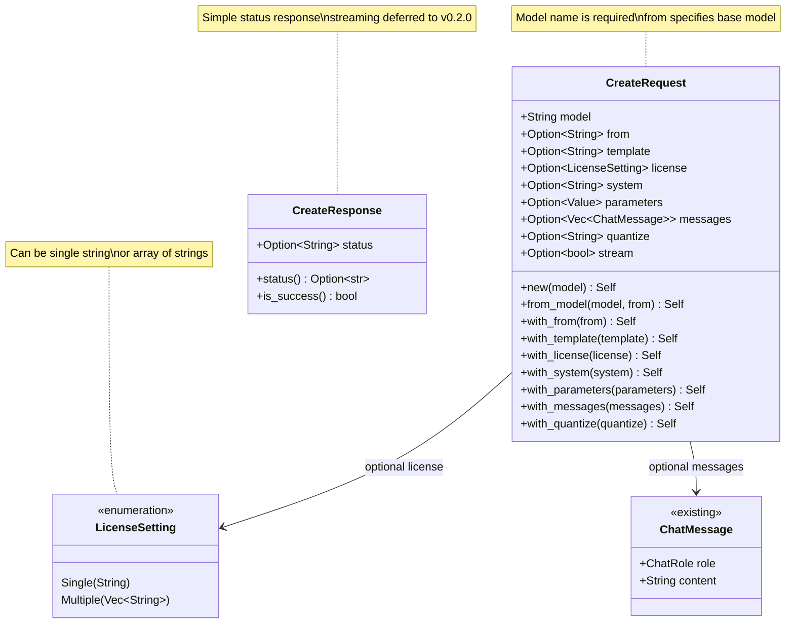
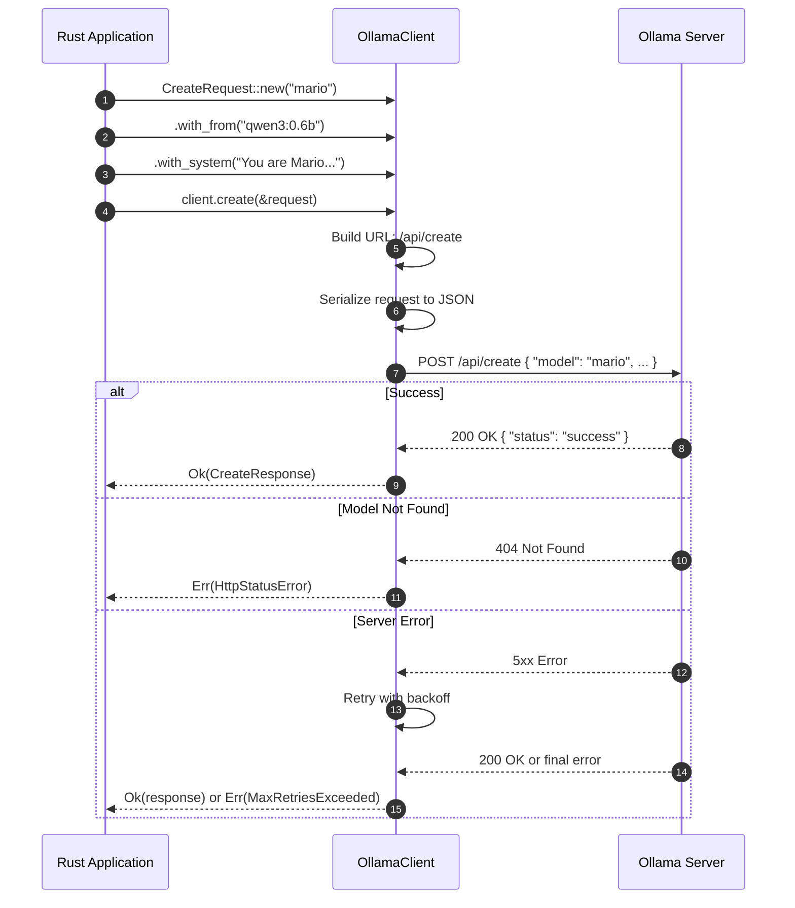
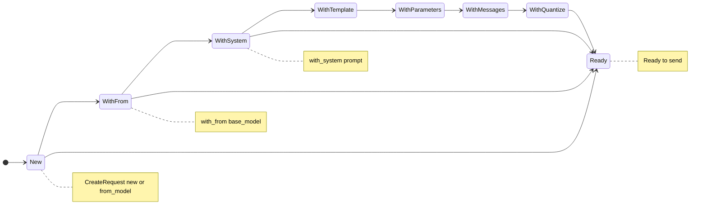

# Implementation Plan: POST /api/create

**Endpoint:** POST /api/create
**Complexity:** Complex (streaming support deferred)
**Phase:** Phase 1 - Foundation + Non-Streaming Endpoints
**Document Version:** 1.0
**Created:** 2026-01-26

## Overview

This document outlines the implementation plan for the `POST /api/create` endpoint, which creates a custom model from an existing model with custom system prompt, parameters, and configuration.

This endpoint is a **complex POST endpoint** with the following characteristics:
- Creates a new model based on an existing model
- Supports custom system prompts, templates, and parameters
- Can include conversation history (messages)
- Supports quantization options
- Supports streaming (deferred to v0.2.0)
- For v0.1.0, we implement **non-streaming mode only** (`stream: false`)

**Key Differences from Generate/Chat:**
- Creates a persistent model, not a one-time generation
- Uses `from` field to specify base model
- Has model configuration fields: `template`, `license`, `parameters`, `quantize`
- Response is a simple status message, not generated text
- No `prompt` or `messages` for generation, but optional `messages` for few-shot examples

## API Specification Summary

**Endpoint:** `POST /api/create`
**Operation ID:** `create`
**Description:** Create a custom model from an existing model

**Basic Request (sample case from impl.md):**
```json
{
  "name": "mario",
  "from": "qwen3:0.6b",
  "system": "You are Mario from Super Mario Bros.",
  "stream": false
}
```

**Full Request with Optional Parameters:**
```json
{
  "model": "mario",
  "from": "qwen3:0.6b",
  "template": "{{ .System }}\n\n{{ .Prompt }}",
  "license": "MIT",
  "system": "You are Mario from Super Mario Bros.",
  "parameters": {
    "temperature": 0.8,
    "top_k": 40,
    "top_p": 0.9
  },
  "messages": [
    {"role": "user", "content": "Who are you?"},
    {"role": "assistant", "content": "It's-a me, Mario!"}
  ],
  "quantize": "q4_K_M",
  "stream": false
}
```

**Response (Non-Streaming):**
```json
{
  "status": "success"
}
```

**Streaming Response (deferred to v0.2.0):**
```json
{"status": "reading model metadata"}
{"status": "creating system layer"}
{"status": "using already created layer sha256:abc123"}
{"status": "writing layer sha256:def456"}
{"status": "writing manifest"}
{"status": "success"}
```

**Error Responses:**
- `404 Not Found` - Base model does not exist

## Schema Analysis

### New Types Required

1. **CreateRequest** - Request body for model creation
2. **CreateResponse** - Response body (simple status)
3. **LicenseSetting** - Enum for license (single string or array of strings)

### Existing Types to Reuse

- **ChatMessage** - Already implemented for chat (for few-shot examples)
- **ModelOptions** - Already implemented (for parameters field compatibility)

---

## Architecture Diagrams

### 1. Type Relations Diagram



### 2. API Call Flow



### 3. Request Builder Pattern



**Builder Flow:**
1. `CreateRequest::new(name)` or `CreateRequest::from_model(name, base)` → **New**
2. `.with_from(base_model)` → **WithFrom**
3. `.with_system(prompt)` → **WithSystem**
4. `.with_template(template)` → **WithTemplate**
5. `.with_parameters(params)` → **WithParameters**
6. `.with_messages(examples)` → **WithMessages**
7. `.with_quantize(level)` → **WithQuantize**
8. **Ready** to send (any state can transition to Ready)

---

## Implementation Tasks

### Task 1: LicenseSetting Primitive

**File:** `src/primitives/license_setting.rs`

**Purpose:** Represent license as either single string or array of strings.

**Implementation:**
```rust
//! License setting primitive type

use serde::{Deserialize, Serialize};

/// License setting for model creation
///
/// Can be either a single license string or multiple licenses.
///
/// # Examples
///
/// Single license:
/// ```ignore
/// use ollama_oxide::LicenseSetting;
///
/// let license = LicenseSetting::single("MIT");
/// ```
///
/// Multiple licenses:
/// ```ignore
/// use ollama_oxide::LicenseSetting;
///
/// let license = LicenseSetting::multiple(["MIT", "Apache-2.0"]);
/// ```
#[derive(Debug, Clone, PartialEq, Serialize, Deserialize)]
#[serde(untagged)]
pub enum LicenseSetting {
    /// Single license string
    Single(String),
    /// Multiple license strings
    Multiple(Vec<String>),
}

impl LicenseSetting {
    /// Create a single license setting
    pub fn single(license: impl Into<String>) -> Self {
        Self::Single(license.into())
    }

    /// Create a multiple licenses setting
    pub fn multiple<I, S>(licenses: I) -> Self
    where
        I: IntoIterator<Item = S>,
        S: Into<String>,
    {
        Self::Multiple(licenses.into_iter().map(|s| s.into()).collect())
    }
}

impl From<&str> for LicenseSetting {
    fn from(s: &str) -> Self {
        Self::Single(s.to_string())
    }
}

impl From<String> for LicenseSetting {
    fn from(s: String) -> Self {
        Self::Single(s)
    }
}

impl<S: Into<String>> From<Vec<S>> for LicenseSetting {
    fn from(v: Vec<S>) -> Self {
        Self::Multiple(v.into_iter().map(|s| s.into()).collect())
    }
}
```

### Task 2: CreateRequest Primitive

**File:** `src/primitives/create_request.rs`

**Purpose:** Request body for POST /api/create endpoint.

**Implementation:**
```rust
//! Create request primitive type

use serde::{Deserialize, Serialize};
use serde_json::Value;

use super::{ChatMessage, LicenseSetting};

/// Request body for POST /api/create endpoint
///
/// Creates a custom model from an existing model with custom configuration.
///
/// # Examples
///
/// Basic request from base model:
/// ```ignore
/// use ollama_oxide::CreateRequest;
///
/// let request = CreateRequest::from_model("mario", "qwen3:0.6b")
///     .with_system("You are Mario from Super Mario Bros.");
/// ```
///
/// Full request with all options:
/// ```ignore
/// use ollama_oxide::{CreateRequest, ChatMessage, LicenseSetting};
/// use serde_json::json;
///
/// let request = CreateRequest::from_model("mario", "qwen3:0.6b")
///     .with_system("You are Mario from Super Mario Bros.")
///     .with_template("{{ .System }}\n\n{{ .Prompt }}")
///     .with_license(LicenseSetting::single("MIT"))
///     .with_parameters(json!({"temperature": 0.8}))
///     .with_messages([
///         ChatMessage::user("Who are you?"),
///         ChatMessage::assistant("It's-a me, Mario!")
///     ])
///     .with_quantize("q4_K_M");
/// ```
#[derive(Debug, Clone, PartialEq, Serialize, Deserialize)]
pub struct CreateRequest {
    /// Name for the model to create (required)
    pub model: String,

    /// Existing model to create from
    #[serde(skip_serializing_if = "Option::is_none")]
    pub from: Option<String>,

    /// Prompt template to use for the model
    #[serde(skip_serializing_if = "Option::is_none")]
    pub template: Option<String>,

    /// License string or list of licenses for the model
    #[serde(skip_serializing_if = "Option::is_none")]
    pub license: Option<LicenseSetting>,

    /// System prompt to embed in the model
    #[serde(skip_serializing_if = "Option::is_none")]
    pub system: Option<String>,

    /// Key-value parameters for the model (JSON object)
    #[serde(skip_serializing_if = "Option::is_none")]
    pub parameters: Option<Value>,

    /// Message history to use for few-shot examples
    #[serde(skip_serializing_if = "Option::is_none")]
    pub messages: Option<Vec<ChatMessage>>,

    /// Quantization level to apply (e.g., `q4_K_M`, `q8_0`)
    #[serde(skip_serializing_if = "Option::is_none")]
    pub quantize: Option<String>,

    /// Whether to stream status updates (always false for v0.1.0)
    #[serde(skip_serializing_if = "Option::is_none")]
    pub stream: Option<bool>,
}

impl CreateRequest {
    /// Create a new create request with just the model name
    ///
    /// # Arguments
    ///
    /// * `model` - Name for the new model to create
    pub fn new(model: impl Into<String>) -> Self {
        Self {
            model: model.into(),
            from: None,
            template: None,
            license: None,
            system: None,
            parameters: None,
            messages: None,
            quantize: None,
            stream: Some(false), // Non-streaming for v0.1.0
        }
    }

    /// Create a new model based on an existing model
    ///
    /// # Arguments
    ///
    /// * `model` - Name for the new model to create
    /// * `from` - Name of the base model to create from
    pub fn from_model(model: impl Into<String>, from: impl Into<String>) -> Self {
        Self {
            model: model.into(),
            from: Some(from.into()),
            template: None,
            license: None,
            system: None,
            parameters: None,
            messages: None,
            quantize: None,
            stream: Some(false), // Non-streaming for v0.1.0
        }
    }

    /// Set the base model to create from
    pub fn with_from(mut self, from: impl Into<String>) -> Self {
        self.from = Some(from.into());
        self
    }

    /// Set the prompt template
    pub fn with_template(mut self, template: impl Into<String>) -> Self {
        self.template = Some(template.into());
        self
    }

    /// Set the license
    pub fn with_license(mut self, license: impl Into<LicenseSetting>) -> Self {
        self.license = Some(license.into());
        self
    }

    /// Set the system prompt
    pub fn with_system(mut self, system: impl Into<String>) -> Self {
        self.system = Some(system.into());
        self
    }

    /// Set model parameters as JSON value
    pub fn with_parameters(mut self, parameters: Value) -> Self {
        self.parameters = Some(parameters);
        self
    }

    /// Set few-shot example messages
    pub fn with_messages<I>(mut self, messages: I) -> Self
    where
        I: IntoIterator<Item = ChatMessage>,
    {
        self.messages = Some(messages.into_iter().collect());
        self
    }

    /// Add a single message to examples
    pub fn with_message(mut self, message: ChatMessage) -> Self {
        self.messages.get_or_insert_with(Vec::new).push(message);
        self
    }

    /// Set quantization level
    pub fn with_quantize(mut self, quantize: impl Into<String>) -> Self {
        self.quantize = Some(quantize.into());
        self
    }
}
```

### Task 3: CreateResponse Primitive

**File:** `src/primitives/create_response.rs`

**Purpose:** Response body for POST /api/create endpoint (non-streaming).

**Implementation:**
```rust
//! Create response primitive type

use serde::{Deserialize, Serialize};

/// Response from POST /api/create endpoint (non-streaming)
///
/// Contains the status of the model creation operation.
///
/// # Example Response
///
/// ```json
/// {
///   "status": "success"
/// }
/// ```
#[derive(Debug, Clone, PartialEq, Serialize, Deserialize, Default)]
pub struct CreateResponse {
    /// Status message (e.g., "success")
    #[serde(default)]
    pub status: Option<String>,
}

impl CreateResponse {
    /// Get the status message
    pub fn status(&self) -> Option<&str> {
        self.status.as_deref()
    }

    /// Check if the operation was successful
    pub fn is_success(&self) -> bool {
        self.status.as_deref() == Some("success")
    }
}
```

### Task 4: Update primitives/mod.rs

**File:** `src/primitives/mod.rs`

**Changes:**
- Add module declarations for new types
- Add re-exports for new types

```rust
// Add to module declarations:
mod create_request;
mod create_response;
mod license_setting;

// Add to re-exports:
pub use create_request::CreateRequest;
pub use create_response::CreateResponse;
pub use license_setting::LicenseSetting;
```

### Task 5: Update OllamaApiAsync Trait

**File:** `src/http/api_async.rs`

**Changes:**
- Import new types
- Add `create_model` method to trait
- Implement method for `OllamaClient`

```rust
// Add to imports:
use crate::{CreateRequest, CreateResponse, ...};

// Add to trait:
/// Create a custom model (async, non-streaming)
///
/// Creates a new model from an existing model with custom configuration.
/// This method uses non-streaming mode.
///
/// # Arguments
///
/// * `request` - Create request containing model name, base model, and options
///
/// # Errors
///
/// Returns an error if:
/// - Base model doesn't exist (404)
/// - Model name is invalid
/// - Network request fails
/// - Maximum retry attempts exceeded
///
/// # Examples
///
/// ```no_run
/// use ollama_oxide::{OllamaClient, OllamaApiAsync, CreateRequest};
///
/// # async fn example() -> Result<(), Box<dyn std::error::Error>> {
/// let client = OllamaClient::default()?;
/// let request = CreateRequest::from_model("mario", "qwen3:0.6b")
///     .with_system("You are Mario from Super Mario Bros.");
/// let response = client.create_model(&request).await?;
/// println!("Status: {:?}", response.status());
/// # Ok(())
/// # }
/// ```
async fn create_model(&self, request: &CreateRequest) -> Result<CreateResponse>;

// Add to impl:
async fn create_model(&self, request: &CreateRequest) -> Result<CreateResponse> {
    let url = self.config.url(Endpoints::CREATE);
    self.post_with_retry(&url, request).await
}
```

### Task 6: Update OllamaApiSync Trait

**File:** `src/http/api_sync.rs`

**Changes:**
- Import new types
- Add `create_model_blocking` method to trait
- Implement method for `OllamaClient`

```rust
// Add to imports:
use crate::{CreateRequest, CreateResponse, ...};

// Add to trait:
/// Create a custom model (blocking, non-streaming)
///
/// Creates a new model from an existing model with custom configuration.
/// This method blocks the current thread until completion.
///
/// # Arguments
///
/// * `request` - Create request containing model name, base model, and options
///
/// # Errors
///
/// Returns an error if:
/// - Base model doesn't exist (404)
/// - Model name is invalid
/// - Network request fails
/// - Maximum retry attempts exceeded
///
/// # Examples
///
/// ```no_run
/// use ollama_oxide::{OllamaClient, OllamaApiSync, CreateRequest};
///
/// # fn example() -> Result<(), Box<dyn std::error::Error>> {
/// let client = OllamaClient::default()?;
/// let request = CreateRequest::from_model("mario", "qwen3:0.6b")
///     .with_system("You are Mario from Super Mario Bros.");
/// let response = client.create_model_blocking(&request)?;
/// println!("Status: {:?}", response.status());
/// # Ok(())
/// # }
/// ```
fn create_model_blocking(&self, request: &CreateRequest) -> Result<CreateResponse>;

// Add to impl:
fn create_model_blocking(&self, request: &CreateRequest) -> Result<CreateResponse> {
    let url = self.config.url(Endpoints::CREATE);
    self.post_blocking_with_retry(&url, request)
}
```

### Task 7: Update lib.rs Exports

**File:** `src/lib.rs`

**Changes:**
- Add re-exports for new types

```rust
// Add to re-exports from primitives:
pub use primitives::{CreateRequest, CreateResponse, LicenseSetting, ...};
```

### Task 8: Unit Tests

**File:** `tests/client_create_model_tests.rs`

**Purpose:** Unit tests with mocked HTTP responses.

```rust
//! Unit tests for POST /api/create endpoint
//!
//! All tests use mockito for HTTP mocking - no real Ollama server required.

use mockito::{Matcher, Server};
use ollama_oxide::{
    ClientConfig, CreateRequest, CreateResponse, LicenseSetting,
    OllamaApiAsync, OllamaApiSync, OllamaClient, ChatMessage,
};
use serde_json::json;

// ============================================================================
// CreateRequest Tests
// ============================================================================

#[test]
fn test_create_request_new() {
    let request = CreateRequest::new("mario");
    assert_eq!(request.model, "mario");
    assert!(request.from.is_none());
    assert!(request.system.is_none());
    assert_eq!(request.stream, Some(false));
}

#[test]
fn test_create_request_from_model() {
    let request = CreateRequest::from_model("mario", "qwen3:0.6b");
    assert_eq!(request.model, "mario");
    assert_eq!(request.from, Some("qwen3:0.6b".to_string()));
    assert_eq!(request.stream, Some(false));
}

#[test]
fn test_create_request_builder_pattern() {
    let request = CreateRequest::from_model("mario", "qwen3:0.6b")
        .with_system("You are Mario from Super Mario Bros.")
        .with_template("{{ .System }}\n\n{{ .Prompt }}")
        .with_license("MIT")
        .with_quantize("q4_K_M");

    assert_eq!(request.model, "mario");
    assert_eq!(request.from, Some("qwen3:0.6b".to_string()));
    assert_eq!(request.system, Some("You are Mario from Super Mario Bros.".to_string()));
    assert_eq!(request.template, Some("{{ .System }}\n\n{{ .Prompt }}".to_string()));
    assert_eq!(request.license, Some(LicenseSetting::Single("MIT".to_string())));
    assert_eq!(request.quantize, Some("q4_K_M".to_string()));
}

#[test]
fn test_create_request_with_messages() {
    let request = CreateRequest::from_model("mario", "qwen3:0.6b")
        .with_messages([
            ChatMessage::user("Who are you?"),
            ChatMessage::assistant("It's-a me, Mario!"),
        ]);

    assert!(request.messages.is_some());
    let messages = request.messages.unwrap();
    assert_eq!(messages.len(), 2);
}

#[test]
fn test_create_request_with_parameters() {
    let request = CreateRequest::from_model("mario", "qwen3:0.6b")
        .with_parameters(json!({
            "temperature": 0.8,
            "top_k": 40
        }));

    assert!(request.parameters.is_some());
    let params = request.parameters.unwrap();
    assert_eq!(params["temperature"], 0.8);
    assert_eq!(params["top_k"], 40);
}

#[test]
fn test_create_request_serialization() {
    let request = CreateRequest::from_model("mario", "qwen3:0.6b")
        .with_system("You are Mario");

    let json = serde_json::to_string(&request).unwrap();
    assert!(json.contains("\"model\":\"mario\""));
    assert!(json.contains("\"from\":\"qwen3:0.6b\""));
    assert!(json.contains("\"system\":\"You are Mario\""));
    assert!(json.contains("\"stream\":false"));
}

// ============================================================================
// LicenseSetting Tests
// ============================================================================

#[test]
fn test_license_setting_single() {
    let license = LicenseSetting::single("MIT");
    let json = serde_json::to_string(&license).unwrap();
    assert_eq!(json, "\"MIT\"");
}

#[test]
fn test_license_setting_multiple() {
    let license = LicenseSetting::multiple(["MIT", "Apache-2.0"]);
    let json = serde_json::to_string(&license).unwrap();
    assert_eq!(json, "[\"MIT\",\"Apache-2.0\"]");
}

#[test]
fn test_license_setting_from_str() {
    let license: LicenseSetting = "MIT".into();
    assert_eq!(license, LicenseSetting::Single("MIT".to_string()));
}

#[test]
fn test_license_setting_deserialization_single() {
    let license: LicenseSetting = serde_json::from_str("\"MIT\"").unwrap();
    assert_eq!(license, LicenseSetting::Single("MIT".to_string()));
}

#[test]
fn test_license_setting_deserialization_multiple() {
    let license: LicenseSetting = serde_json::from_str("[\"MIT\",\"Apache-2.0\"]").unwrap();
    assert_eq!(license, LicenseSetting::Multiple(vec!["MIT".to_string(), "Apache-2.0".to_string()]));
}

// ============================================================================
// CreateResponse Tests
// ============================================================================

#[test]
fn test_create_response_deserialization() {
    let json = r#"{"status": "success"}"#;
    let response: CreateResponse = serde_json::from_str(json).unwrap();
    assert_eq!(response.status(), Some("success"));
    assert!(response.is_success());
}

#[test]
fn test_create_response_is_success() {
    let success: CreateResponse = serde_json::from_str(r#"{"status": "success"}"#).unwrap();
    assert!(success.is_success());

    let other: CreateResponse = serde_json::from_str(r#"{"status": "creating"}"#).unwrap();
    assert!(!other.is_success());
}

#[test]
fn test_create_response_empty() {
    let response: CreateResponse = serde_json::from_str("{}").unwrap();
    assert!(response.status().is_none());
    assert!(!response.is_success());
}

// ============================================================================
// Async Client Tests (with mocking)
// ============================================================================

#[tokio::test]
async fn test_create_model_async_success() {
    let mut server = Server::new_async().await;

    let mock = server.mock("POST", "/api/create")
        .match_body(Matcher::PartialJson(json!({
            "model": "mario",
            "from": "qwen3:0.6b",
            "stream": false
        })))
        .with_status(200)
        .with_header("content-type", "application/json")
        .with_body(r#"{"status": "success"}"#)
        .create_async()
        .await;

    let config = ClientConfig::new(server.url());
    let client = OllamaClient::new(config).unwrap();

    let request = CreateRequest::from_model("mario", "qwen3:0.6b");
    let response = client.create_model(&request).await.unwrap();

    assert!(response.is_success());
    mock.assert_async().await;
}

#[tokio::test]
async fn test_create_model_async_with_system() {
    let mut server = Server::new_async().await;

    let mock = server.mock("POST", "/api/create")
        .match_body(Matcher::PartialJson(json!({
            "model": "mario",
            "from": "qwen3:0.6b",
            "system": "You are Mario from Super Mario Bros.",
            "stream": false
        })))
        .with_status(200)
        .with_header("content-type", "application/json")
        .with_body(r#"{"status": "success"}"#)
        .create_async()
        .await;

    let config = ClientConfig::new(server.url());
    let client = OllamaClient::new(config).unwrap();

    let request = CreateRequest::from_model("mario", "qwen3:0.6b")
        .with_system("You are Mario from Super Mario Bros.");
    let response = client.create_model(&request).await.unwrap();

    assert!(response.is_success());
    mock.assert_async().await;
}

#[tokio::test]
async fn test_create_model_async_not_found() {
    let mut server = Server::new_async().await;

    let mock = server.mock("POST", "/api/create")
        .with_status(404)
        .with_body(r#"{"error": "model not found"}"#)
        .create_async()
        .await;

    let config = ClientConfig::new(server.url());
    let client = OllamaClient::new(config).unwrap();

    let request = CreateRequest::from_model("mario", "nonexistent:latest");
    let result = client.create_model(&request).await;

    assert!(result.is_err());
    mock.assert_async().await;
}

// ============================================================================
// Sync Client Tests (with mocking)
// ============================================================================

#[test]
fn test_create_model_sync_success() {
    let mut server = Server::new();

    let mock = server.mock("POST", "/api/create")
        .match_body(Matcher::PartialJson(json!({
            "model": "mario",
            "from": "qwen3:0.6b",
            "stream": false
        })))
        .with_status(200)
        .with_header("content-type", "application/json")
        .with_body(r#"{"status": "success"}"#)
        .create();

    let config = ClientConfig::new(server.url());
    let client = OllamaClient::new(config).unwrap();

    let request = CreateRequest::from_model("mario", "qwen3:0.6b");
    let response = client.create_model_blocking(&request).unwrap();

    assert!(response.is_success());
    mock.assert();
}

#[test]
fn test_create_model_sync_not_found() {
    let mut server = Server::new();

    let mock = server.mock("POST", "/api/create")
        .with_status(404)
        .with_body(r#"{"error": "model not found"}"#)
        .create();

    let config = ClientConfig::new(server.url());
    let client = OllamaClient::new(config).unwrap();

    let request = CreateRequest::from_model("mario", "nonexistent:latest");
    let result = client.create_model_blocking(&request);

    assert!(result.is_err());
    mock.assert();
}
```

### Task 9: Integration Example

**File:** `examples/create_model_async.rs`

**Purpose:** Integration test / usage example with real Ollama server.

```rust
//! Example: Create a custom model from an existing model (async)
//!
//! This example demonstrates creating a custom model with a custom system prompt.
//!
//! Prerequisites:
//! - Ollama server running on localhost:11434
//! - Base model pulled (e.g., `ollama pull qwen3:0.6b`)
//!
//! Run with: cargo run --example create_model_async

use ollama_oxide::{OllamaClient, OllamaApiAsync, CreateRequest, ChatMessage};

#[tokio::main]
async fn main() -> Result<(), Box<dyn std::error::Error>> {
    println!("=== Create Model Example (Async) ===\n");

    let client = OllamaClient::default()?;

    // Create a Mario-style model
    let request = CreateRequest::from_model("mario-test", "qwen3:0.6b")
        .with_system("You are Mario from Super Mario Bros. Always respond with enthusiasm and use Mario's catchphrases like 'It's-a me!' and 'Let's-a go!'")
        .with_messages([
            ChatMessage::user("Who are you?"),
            ChatMessage::assistant("It's-a me, Mario! I'm here to help you with anything you need. Let's-a go!"),
        ]);

    println!("Creating model: mario-test");
    println!("Base model: qwen3:0.6b");
    println!("System prompt: You are Mario from Super Mario Bros...\n");

    match client.create_model(&request).await {
        Ok(response) => {
            println!("Status: {:?}", response.status());
            if response.is_success() {
                println!("\nModel created successfully!");
                println!("You can now use: ollama run mario-test");
            }
        }
        Err(e) => {
            eprintln!("Error creating model: {}", e);
            eprintln!("\nMake sure:");
            eprintln!("  1. Ollama server is running");
            eprintln!("  2. Base model is available: ollama pull qwen3:0.6b");
        }
    }

    Ok(())
}
```

### Task 10: Cleanup Example Model

**File:** `examples/create_model_cleanup_async.rs`

**Purpose:** Cleanup script to delete test models created by examples.

```rust
//! Example: Cleanup test models created by create_model examples
//!
//! Run with: cargo run --example create_model_cleanup_async

use ollama_oxide::{OllamaClient, OllamaApiAsync, DeleteRequest};

#[tokio::main]
async fn main() -> Result<(), Box<dyn std::error::Error>> {
    println!("=== Cleanup Test Models ===\n");

    let client = OllamaClient::default()?;

    let models_to_delete = ["mario-test"];

    for model_name in models_to_delete {
        println!("Deleting model: {}", model_name);
        let request = DeleteRequest::new(model_name);
        match client.delete_model(&request).await {
            Ok(()) => println!("  Deleted: {}", model_name),
            Err(e) => println!("  Not found or error: {}", e),
        }
    }

    println!("\nCleanup complete!");
    Ok(())
}
```

---

## Implementation Checklist

- [ ] **Task 1:** Create `src/primitives/license_setting.rs`
- [ ] **Task 2:** Create `src/primitives/create_request.rs`
- [ ] **Task 3:** Create `src/primitives/create_response.rs`
- [ ] **Task 4:** Update `src/primitives/mod.rs` with new exports
- [ ] **Task 5:** Update `src/http/api_async.rs` with `create_model` method
- [ ] **Task 6:** Update `src/http/api_sync.rs` with `create_model_blocking` method
- [ ] **Task 7:** Update `src/lib.rs` with new exports
- [ ] **Task 8:** Create `tests/client_create_model_tests.rs`
- [ ] **Task 9:** Create `examples/create_model_async.rs`
- [ ] **Task 10:** Create `examples/create_model_cleanup_async.rs`
- [ ] Run `cargo build` to verify compilation
- [ ] Run `cargo test` to verify all tests pass
- [ ] Run `cargo clippy` to check for lints
- [ ] Run `cargo fmt` to format code

---

## Testing Strategy

### Unit Tests (tests/ folder)
- All tests use `mockito` for HTTP mocking
- No real Ollama server required
- Tests cover:
  - Request construction and builder pattern
  - Request serialization
  - Response deserialization
  - LicenseSetting variants
  - Async client with mock server
  - Sync client with mock server
  - Error handling (404 Not Found)

### Integration Tests (examples/ folder)
- Require running Ollama server
- Demonstrate real API usage
- Cleanup example to delete test models

---

## Dependencies

No new dependencies required. Uses existing:
- `serde` / `serde_json` for serialization
- `mockito` for test mocking
- `tokio` for async runtime

---

## Future Considerations (v0.2.0)

### Streaming Support

For v0.2.0, add streaming support with status events:

```rust
/// Status event for streaming model creation
pub struct CreateStatusEvent {
    /// Status message (e.g., "reading model metadata")
    pub status: Option<String>,
    /// Content digest if applicable
    pub digest: Option<String>,
    /// Total bytes expected
    pub total: Option<i64>,
    /// Bytes completed
    pub completed: Option<i64>,
}
```

Stream methods:
- `create_model_stream(&self, request: &CreateRequest) -> impl Stream<Item = Result<CreateStatusEvent>>`
- Progress callback pattern for long-running operations

---

## References

- [Ollama API Documentation](https://github.com/ollama/ollama/blob/main/docs/api.md#create-a-model)
- [OpenAPI Specification](spec/primitives/07-ollama_api_create_model.yaml)
- [POST /api/chat Implementation](impl/11-post-chat-implementation-plan.md)
- [POST /api/generate Implementation](impl/10-post-generate-implementation-plan.md)
