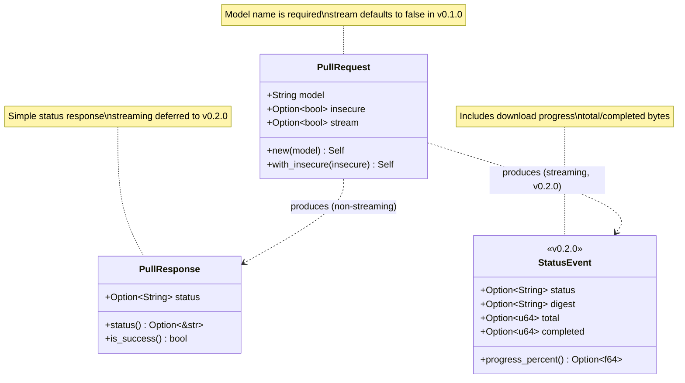
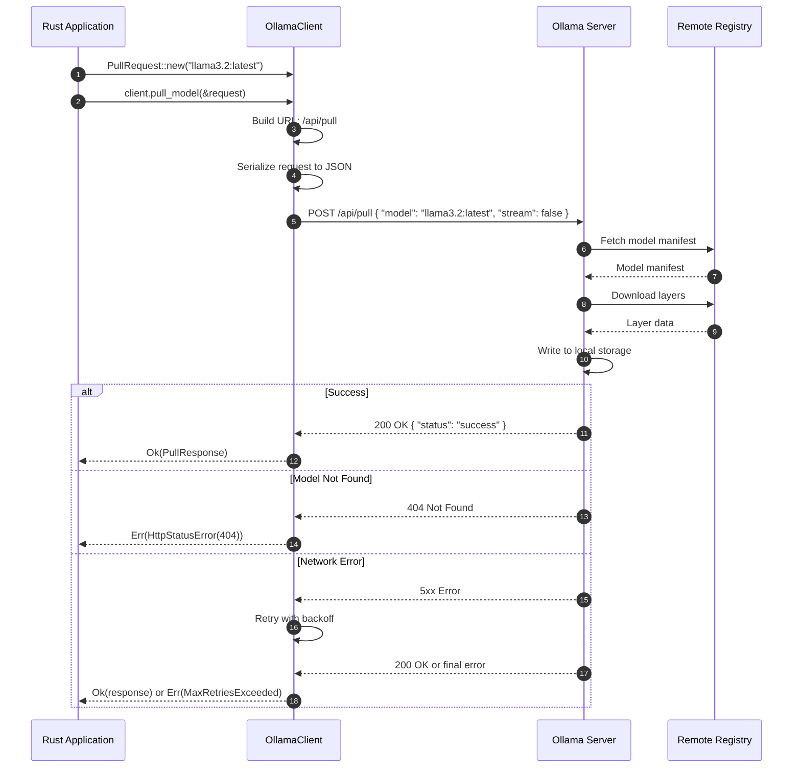
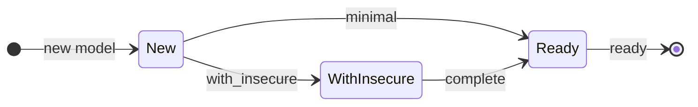

# Implementation Plan: POST /api/pull

**Endpoint:** POST /api/pull
**Complexity:** Complex (streaming support deferred)
**Phase:** Phase 1 - Foundation + Non-Streaming Endpoints
**Document Version:** 1.0
**Created:** 2026-02-03

## Overview

This document outlines the implementation plan for the `POST /api/pull` endpoint, which downloads (pulls) a model from a remote registry (e.g., ollama.com/library).

This endpoint is a **complex POST endpoint** with the following characteristics:
- Downloads a model from the Ollama registry
- Supports streaming progress updates (deferred to v0.2.0)
- Provides download progress information (digest, total bytes, completed bytes)
- Has an optional `insecure` flag for connections without TLS verification
- For v0.1.0, we implement **non-streaming mode only** (`stream: false`)

**Key Characteristics:**
- Long-running operation (model downloads can take several minutes)
- Progress tracking for large files
- Similar to POST /api/push but for downloads instead of uploads
- Uses same `StatusResponse` / `StatusEvent` pattern as create/push endpoints

## API Specification Summary

**Endpoint:** `POST /api/pull`
**Operation ID:** `pull`
**Description:** Download a model from the remote registry

**Basic Request:**
```json
{
  "model": "llama3.2:latest",
  "stream": false
}
```

**Full Request with Optional Parameters:**
```json
{
  "model": "llama3.2:latest",
  "insecure": false,
  "stream": false
}
```

**Response (Non-Streaming):**
```json
{
  "status": "success"
}
```

**Streaming Response (deferred to v0.2.0):**
```json
{"status": "pulling manifest"}
{"status": "downloading sha256:abc123", "digest": "sha256:abc123", "total": 1000000, "completed": 0}
{"status": "downloading sha256:abc123", "digest": "sha256:abc123", "total": 1000000, "completed": 500000}
{"status": "downloading sha256:abc123", "digest": "sha256:abc123", "total": 1000000, "completed": 1000000}
{"status": "verifying sha256 digest"}
{"status": "writing manifest"}
{"status": "success"}
```

**Error Responses:**
- `404 Not Found` - Model does not exist in registry

## Schema Analysis

### New Types Required

1. **PullRequest** - Request body for model download
2. **StatusResponse** - Response body (simple status) - already exists from CreateResponse pattern
3. **StatusEvent** - Streaming event with progress (deferred to v0.2.0)

### Existing Types to Reuse

- **CreateResponse** - Can be reused or renamed to generic `StatusResponse`

### Type Consolidation Decision

Since `CreateResponse`, `PullResponse`, and `PushResponse` all have the same structure (`{ "status": "..." }`), we have two options:

**Option A: Reuse CreateResponse**
- Pros: Less code, single type
- Cons: Semantically confusing (CreateResponse for pull?)

**Option B: Create separate types with same structure**
- Pros: Clear semantics, better documentation
- Cons: Code duplication

**Recommendation:** Create `PullResponse` as a separate type alias or struct for semantic clarity. In the future (v0.3.0+), consider a generic `StatusResponse` type.

---

## Architecture Diagrams

### 1. Type Relations Diagram



### 2. API Call Flow



### 3. Request Builder Pattern



---

## Implementation Phases

### Phase 1: Types (src/model/)

#### 1.1 PullRequest (src/model/pull_request.rs)

```rust
use serde::{Deserialize, Serialize};

/// Request body for POST /api/pull endpoint.
///
/// Downloads a model from the Ollama registry.
///
/// # JSON Examples
///
/// Minimal request:
/// ```json
/// {
///   "model": "llama3.2:latest"
/// }
/// ```
///
/// Full request with options:
/// ```json
/// {
///   "model": "llama3.2:latest",
///   "insecure": false,
///   "stream": false
/// }
/// ```
#[derive(Debug, Clone, PartialEq, Serialize, Deserialize)]
pub struct PullRequest {
    /// Name of the model to download (e.g., "llama3.2:latest", "gemma:7b")
    pub model: String,

    /// Allow downloading over insecure connections (without TLS verification)
    #[serde(skip_serializing_if = "Option::is_none")]
    pub insecure: Option<bool>,

    /// Stream progress updates. Default: true in Ollama, but we set false for v0.1.0
    #[serde(skip_serializing_if = "Option::is_none")]
    stream: Option<bool>,
}

impl PullRequest {
    /// Create a new pull request for the specified model.
    ///
    /// The request is configured with `stream: false` for non-streaming mode.
    ///
    /// # Arguments
    ///
    /// * `model` - Name of the model to download (e.g., "llama3.2:latest")
    ///
    /// # Example
    ///
    /// ```
    /// use ollama_oxide::PullRequest;
    ///
    /// let request = PullRequest::new("llama3.2:latest");
    /// ```
    pub fn new<M: Into<String>>(model: M) -> Self {
        Self {
            model: model.into(),
            insecure: None,
            stream: Some(false), // v0.1.0: non-streaming only
        }
    }

    /// Allow downloading over insecure connections.
    ///
    /// When set to `true`, the download will proceed without TLS verification.
    /// Use with caution, only in trusted network environments.
    ///
    /// # Arguments
    ///
    /// * `insecure` - Whether to allow insecure connections
    ///
    /// # Example
    ///
    /// ```
    /// use ollama_oxide::PullRequest;
    ///
    /// let request = PullRequest::new("llama3.2:latest")
    ///     .with_insecure(true);
    /// ```
    pub fn with_insecure(mut self, insecure: bool) -> Self {
        self.insecure = Some(insecure);
        self
    }
}
```

#### 1.2 PullResponse (src/model/pull_response.rs)

```rust
use serde::{Deserialize, Serialize};

/// Response from POST /api/pull endpoint.
///
/// Contains the status of the pull operation.
///
/// # JSON Example
///
/// ```json
/// {
///   "status": "success"
/// }
/// ```
#[derive(Debug, Clone, PartialEq, Serialize, Deserialize)]
pub struct PullResponse {
    /// Status message indicating the result of the operation
    #[serde(default)]
    pub status: Option<String>,
}

impl PullResponse {
    /// Get the status message.
    ///
    /// # Returns
    ///
    /// The status string if present, or None.
    pub fn status(&self) -> Option<&str> {
        self.status.as_deref()
    }

    /// Check if the pull operation was successful.
    ///
    /// # Returns
    ///
    /// `true` if status is "success", `false` otherwise.
    pub fn is_success(&self) -> bool {
        self.status.as_deref() == Some("success")
    }
}
```

### Phase 2: Module Updates

#### 2.1 Update src/model/mod.rs

Add the new types to the model module:

```rust
mod pull_request;
mod pull_response;

pub use pull_request::PullRequest;
pub use pull_response::PullResponse;
```

#### 2.2 Update src/lib.rs

Re-export the new types from the library root (under `model` feature):

```rust
#[cfg(feature = "model")]
pub use model::{
    // ... existing exports ...
    PullRequest,
    PullResponse,
};
```

### Phase 3: HTTP Client Methods

#### 3.1 Async Method (src/http/api_async.rs)

```rust
/// Pull (download) a model from the Ollama registry.
///
/// Downloads the specified model from the remote registry to the local
/// Ollama server. This operation may take several minutes depending on
/// model size and network speed.
///
/// # Arguments
///
/// * `request` - The pull request containing the model name and options
///
/// # Returns
///
/// A `PullResponse` indicating the success or failure of the operation.
///
/// # Errors
///
/// * `HttpStatusError(404)` - Model not found in registry
/// * `HttpError` - Network or HTTP errors
/// * `MaxRetriesExceededError` - Server errors after all retries
///
/// # Example
///
/// ```no_run
/// use ollama_oxide::{OllamaClient, OllamaApiAsync, PullRequest};
///
/// #[tokio::main]
/// async fn main() -> Result<(), Box<dyn std::error::Error>> {
///     let client = OllamaClient::default()?;
///
///     let request = PullRequest::new("llama3.2:latest");
///     let response = client.pull_model(&request).await?;
///
///     if response.is_success() {
///         println!("Model downloaded successfully!");
///     }
///
///     Ok(())
/// }
/// ```
#[cfg(feature = "model")]
async fn pull_model(&self, request: &PullRequest) -> Result<PullResponse>;
```

Implementation:

```rust
#[cfg(feature = "model")]
async fn pull_model(&self, request: &PullRequest) -> Result<PullResponse> {
    let url = self.config.url(Endpoints::PULL);
    self.post_with_retry(&url, request).await
}
```

#### 3.2 Sync Method (src/http/api_sync.rs)

```rust
/// Pull (download) a model from the Ollama registry (blocking).
///
/// Downloads the specified model from the remote registry to the local
/// Ollama server. This operation may take several minutes depending on
/// model size and network speed.
///
/// # Arguments
///
/// * `request` - The pull request containing the model name and options
///
/// # Returns
///
/// A `PullResponse` indicating the success or failure of the operation.
///
/// # Errors
///
/// * `HttpStatusError(404)` - Model not found in registry
/// * `HttpError` - Network or HTTP errors
/// * `MaxRetriesExceededError` - Server errors after all retries
///
/// # Example
///
/// ```no_run
/// use ollama_oxide::{OllamaClient, OllamaApiSync, PullRequest};
///
/// fn main() -> Result<(), Box<dyn std::error::Error>> {
///     let client = OllamaClient::default()?;
///
///     let request = PullRequest::new("llama3.2:latest");
///     let response = client.pull_model_blocking(&request)?;
///
///     if response.is_success() {
///         println!("Model downloaded successfully!");
///     }
///
///     Ok(())
/// }
/// ```
#[cfg(feature = "model")]
fn pull_model_blocking(&self, request: &PullRequest) -> Result<PullResponse>;
```

Implementation:

```rust
#[cfg(feature = "model")]
fn pull_model_blocking(&self, request: &PullRequest) -> Result<PullResponse> {
    let url = self.config.url(Endpoints::PULL);
    self.post_blocking_with_retry(&url, request)
}
```

### Phase 4: Tests

#### 4.1 Unit Tests (src/model/pull_request.rs)

```rust
#[cfg(test)]
mod tests {
    use super::*;

    #[test]
    fn test_new_creates_request_with_model() {
        let request = PullRequest::new("llama3.2:latest");
        assert_eq!(request.model, "llama3.2:latest");
        assert_eq!(request.insecure, None);
    }

    #[test]
    fn test_with_insecure_sets_flag() {
        let request = PullRequest::new("llama3.2:latest")
            .with_insecure(true);
        assert_eq!(request.insecure, Some(true));
    }

    #[test]
    fn test_serialization_minimal() {
        let request = PullRequest::new("llama3.2:latest");
        let json = serde_json::to_value(&request).unwrap();

        assert_eq!(json["model"], "llama3.2:latest");
        assert_eq!(json["stream"], false);
        assert!(json.get("insecure").is_none());
    }

    #[test]
    fn test_serialization_full() {
        let request = PullRequest::new("llama3.2:latest")
            .with_insecure(true);
        let json = serde_json::to_value(&request).unwrap();

        assert_eq!(json["model"], "llama3.2:latest");
        assert_eq!(json["insecure"], true);
        assert_eq!(json["stream"], false);
    }

    #[test]
    fn test_deserialization() {
        let json = r#"{"model": "llama3.2:latest", "insecure": false}"#;
        let request: PullRequest = serde_json::from_str(json).unwrap();

        assert_eq!(request.model, "llama3.2:latest");
        assert_eq!(request.insecure, Some(false));
    }
}
```

#### 4.2 Unit Tests (src/model/pull_response.rs)

```rust
#[cfg(test)]
mod tests {
    use super::*;

    #[test]
    fn test_status_returns_value() {
        let response = PullResponse {
            status: Some("success".to_string()),
        };
        assert_eq!(response.status(), Some("success"));
    }

    #[test]
    fn test_status_returns_none_when_missing() {
        let response = PullResponse { status: None };
        assert_eq!(response.status(), None);
    }

    #[test]
    fn test_is_success_true() {
        let response = PullResponse {
            status: Some("success".to_string()),
        };
        assert!(response.is_success());
    }

    #[test]
    fn test_is_success_false_on_other_status() {
        let response = PullResponse {
            status: Some("downloading".to_string()),
        };
        assert!(!response.is_success());
    }

    #[test]
    fn test_is_success_false_on_none() {
        let response = PullResponse { status: None };
        assert!(!response.is_success());
    }

    #[test]
    fn test_deserialization() {
        let json = r#"{"status": "success"}"#;
        let response: PullResponse = serde_json::from_str(json).unwrap();

        assert_eq!(response.status(), Some("success"));
        assert!(response.is_success());
    }

    #[test]
    fn test_deserialization_empty_object() {
        let json = r#"{}"#;
        let response: PullResponse = serde_json::from_str(json).unwrap();

        assert_eq!(response.status(), None);
        assert!(!response.is_success());
    }
}
```

#### 4.3 Client Tests (tests/client_pull_tests.rs)

```rust
//! Tests for POST /api/pull endpoint (pull_model, pull_model_blocking)

use mockito::{Matcher, Server};
use ollama_oxide::{ClientConfig, OllamaApiAsync, OllamaApiSync, OllamaClient, PullRequest};

// ============================================================================
// Async Tests
// ============================================================================

#[tokio::test]
async fn test_pull_model_success() {
    let mut server = Server::new_async().await;
    let mock = server
        .mock("POST", "/api/pull")
        .match_body(Matcher::Json(serde_json::json!({
            "model": "llama3.2:latest",
            "stream": false
        })))
        .with_status(200)
        .with_header("content-type", "application/json")
        .with_body(r#"{"status": "success"}"#)
        .create_async()
        .await;

    let config = ClientConfig::new(server.url()).unwrap();
    let client = OllamaClient::new(config).unwrap();

    let request = PullRequest::new("llama3.2:latest");
    let response = client.pull_model(&request).await.unwrap();

    assert!(response.is_success());
    assert_eq!(response.status(), Some("success"));
    mock.assert_async().await;
}

#[tokio::test]
async fn test_pull_model_with_insecure() {
    let mut server = Server::new_async().await;
    let mock = server
        .mock("POST", "/api/pull")
        .match_body(Matcher::Json(serde_json::json!({
            "model": "private/model:latest",
            "insecure": true,
            "stream": false
        })))
        .with_status(200)
        .with_header("content-type", "application/json")
        .with_body(r#"{"status": "success"}"#)
        .create_async()
        .await;

    let config = ClientConfig::new(server.url()).unwrap();
    let client = OllamaClient::new(config).unwrap();

    let request = PullRequest::new("private/model:latest")
        .with_insecure(true);
    let response = client.pull_model(&request).await.unwrap();

    assert!(response.is_success());
    mock.assert_async().await;
}

#[tokio::test]
async fn test_pull_model_not_found() {
    let mut server = Server::new_async().await;
    let mock = server
        .mock("POST", "/api/pull")
        .with_status(404)
        .with_header("content-type", "application/json")
        .with_body(r#"{"error": "model not found"}"#)
        .create_async()
        .await;

    let config = ClientConfig::new(server.url()).unwrap();
    let client = OllamaClient::new(config).unwrap();

    let request = PullRequest::new("nonexistent:latest");
    let result = client.pull_model(&request).await;

    assert!(result.is_err());
    mock.assert_async().await;
}

// ============================================================================
// Sync Tests
// ============================================================================

#[test]
fn test_pull_model_blocking_success() {
    let mut server = Server::new();
    let mock = server
        .mock("POST", "/api/pull")
        .match_body(Matcher::Json(serde_json::json!({
            "model": "gemma:7b",
            "stream": false
        })))
        .with_status(200)
        .with_header("content-type", "application/json")
        .with_body(r#"{"status": "success"}"#)
        .create();

    let config = ClientConfig::new(server.url()).unwrap();
    let client = OllamaClient::new(config).unwrap();

    let request = PullRequest::new("gemma:7b");
    let response = client.pull_model_blocking(&request).unwrap();

    assert!(response.is_success());
    mock.assert();
}

#[test]
fn test_pull_model_blocking_not_found() {
    let mut server = Server::new();
    let mock = server
        .mock("POST", "/api/pull")
        .with_status(404)
        .create();

    let config = ClientConfig::new(server.url()).unwrap();
    let client = OllamaClient::new(config).unwrap();

    let request = PullRequest::new("nonexistent:latest");
    let result = client.pull_model_blocking(&request);

    assert!(result.is_err());
    mock.assert();
}
```

### Phase 5: Examples

#### 5.1 Async Example (examples/pull_model_async.rs)

```rust
//! Example: Pull (download) a model asynchronously
//!
//! This example demonstrates how to download a model from the Ollama registry
//! using the async API.
//!
//! # Prerequisites
//!
//! - Ollama server running at http://localhost:11434
//! - Internet connection to download from registry
//!
//! # Usage
//!
//! ```sh
//! cargo run --example pull_model_async --features model
//! ```

use ollama_oxide::{OllamaApiAsync, OllamaClient, PullRequest};

#[tokio::main]
async fn main() -> Result<(), Box<dyn std::error::Error>> {
    println!("=== Pull Model Example (Async) ===\n");

    // Create client with default configuration
    let client = OllamaClient::default()?;

    // Pull a small model (all-minilm:33m is very small ~67MB)
    let model_name = "all-minilm:33m";
    println!("Pulling model: {}", model_name);
    println!("This may take a few minutes depending on your connection...\n");

    let request = PullRequest::new(model_name);
    let response = client.pull_model(&request).await?;

    if response.is_success() {
        println!("Model '{}' downloaded successfully!", model_name);
    } else {
        println!("Pull status: {:?}", response.status());
    }

    Ok(())
}
```

#### 5.2 Sync Example (examples/pull_model_sync.rs)

```rust
//! Example: Pull (download) a model synchronously
//!
//! This example demonstrates how to download a model from the Ollama registry
//! using the blocking API.
//!
//! # Prerequisites
//!
//! - Ollama server running at http://localhost:11434
//! - Internet connection to download from registry
//!
//! # Usage
//!
//! ```sh
//! cargo run --example pull_model_sync --features model
//! ```

use ollama_oxide::{OllamaApiSync, OllamaClient, PullRequest};

fn main() -> Result<(), Box<dyn std::error::Error>> {
    println!("=== Pull Model Example (Sync) ===\n");

    // Create client with default configuration
    let client = OllamaClient::default()?;

    // Pull a small model (all-minilm:33m is very small ~67MB)
    let model_name = "all-minilm:33m";
    println!("Pulling model: {}", model_name);
    println!("This may take a few minutes depending on your connection...\n");

    let request = PullRequest::new(model_name);
    let response = client.pull_model_blocking(&request)?;

    if response.is_success() {
        println!("Model '{}' downloaded successfully!", model_name);
    } else {
        println!("Pull status: {:?}", response.status());
    }

    Ok(())
}
```

### Phase 6: Cargo.toml Updates

Add required-features for the new examples and test:

```toml
[[example]]
name = "pull_model_async"
required-features = ["model"]

[[example]]
name = "pull_model_sync"
required-features = ["model"]

[[test]]
name = "client_pull_tests"
required-features = ["model"]
```

---

## Implementation Checklist

### Types
- [ ] Create `src/model/pull_request.rs` with `PullRequest` struct
- [ ] Create `src/model/pull_response.rs` with `PullResponse` struct
- [ ] Update `src/model/mod.rs` with new module declarations and exports
- [ ] Update `src/lib.rs` with re-exports under `model` feature

### HTTP Client
- [ ] Add `pull_model()` async method to `OllamaApiAsync` trait
- [ ] Add `pull_model_blocking()` sync method to `OllamaApiSync` trait
- [ ] Implement methods in `src/http/api_async.rs`
- [ ] Implement methods in `src/http/api_sync.rs`

### Tests
- [ ] Add unit tests in `src/model/pull_request.rs`
- [ ] Add unit tests in `src/model/pull_response.rs`
- [ ] Create `tests/client_pull_tests.rs` with mock tests

### Examples
- [ ] Create `examples/pull_model_async.rs`
- [ ] Create `examples/pull_model_sync.rs`
- [ ] Update `Cargo.toml` with `required-features`

### Validation
- [ ] Run `cargo build --all-features`
- [ ] Run `cargo test --all-features`
- [ ] Run `cargo clippy --all-features`
- [ ] Run `cargo fmt --check`

---

## Future Work (v0.2.0)

### Streaming Support

For v0.2.0, add streaming support with `StatusEvent`:

```rust
/// Progress event for streaming pull/push operations.
#[derive(Debug, Clone, PartialEq, Serialize, Deserialize)]
pub struct StatusEvent {
    /// Human-readable status message
    pub status: Option<String>,

    /// Content digest associated with the status (for downloads)
    pub digest: Option<String>,

    /// Total number of bytes expected
    pub total: Option<u64>,

    /// Number of bytes completed
    pub completed: Option<u64>,
}

impl StatusEvent {
    /// Calculate download progress as a percentage.
    pub fn progress_percent(&self) -> Option<f64> {
        match (self.total, self.completed) {
            (Some(total), Some(completed)) if total > 0 => {
                Some((completed as f64 / total as f64) * 100.0)
            }
            _ => None,
        }
    }
}
```

Streaming API methods:

```rust
/// Pull a model with streaming progress updates.
async fn pull_model_stream(&self, request: &PullRequest) -> Result<impl Stream<Item = Result<StatusEvent>>>;
```

---

## Notes

1. **Long-running operation:** Model downloads can take several minutes. In non-streaming mode, the HTTP connection may timeout. Consider increasing timeout for this endpoint in the future.

2. **Progress tracking:** Without streaming, there's no way to track download progress. Users should be informed that this is a limitation of v0.1.0.

3. **Error handling:** The 404 error for non-existent models is the primary error case. Other errors (network, timeout) are handled by the standard retry logic.

4. **Timeout consideration:** For v0.2.0 with streaming, we may need to handle connection keep-alive and chunked responses properly.
